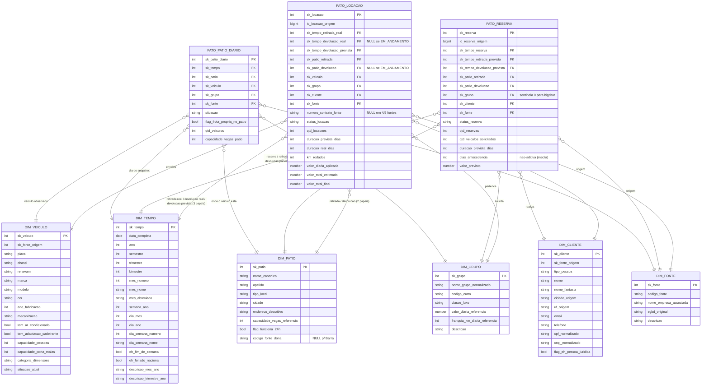

<!--
Avaliação 02 — Modelagem de DW — Parte II
Grupo:
  - Gustavo Oliveira Pessanha da Silva (DRE 122051824)
  - André Vinícius Lobo Giron (DRE 122050404)
-->

# Diagrama do Esquema Estrela — Data Warehouse da Locadora Associada

**Trabalho:** Avaliação 02 — Parte II — Modelagem de Data Warehouse
**Notação:** Mermaid `erDiagram`
**Conteúdo:** 3 tabelas de fato (`FATO_LOCACAO`, `FATO_RESERVA`, `FATO_PATIO_DIARIO`) e 6 dimensões conformadas (`DIM_TEMPO`, `DIM_PATIO`, `DIM_VEICULO`, `DIM_GRUPO`, `DIM_CLIENTE`, `DIM_FONTE`).
**Versão:** v1.1 (após revisão dimensional 2026-05-30 — vide `docs/revisoes/revisao-dimensional.md`).

### Grupo

| Nome completo | DRE |
|---|---|
| Gustavo Oliveira Pessanha da Silva | 122051824 |
| André Vinícius Lobo Giron | 122050404 |

---

