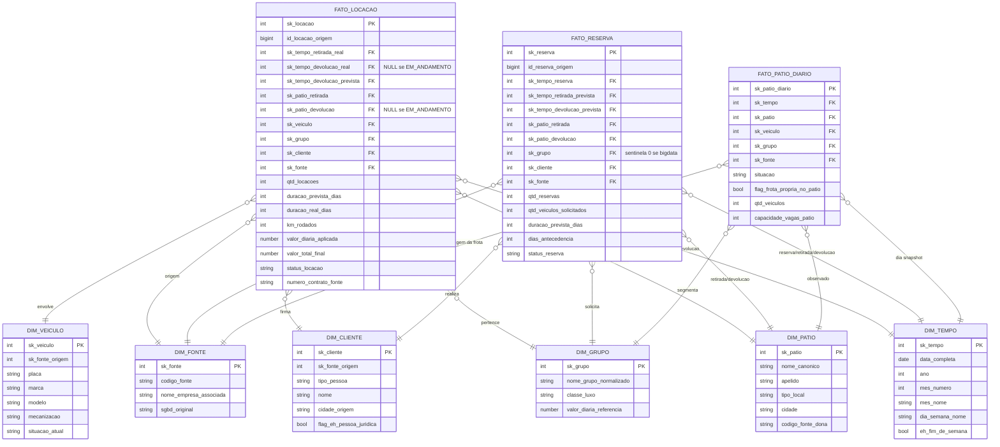

<!--
Avaliação 02 — Modelagem de DW — Parte II
Grupo:
  - Gustavo Oliveira Pessanha da Silva (DRE 122051824)
  - André Vinícius Lobo Giron (DRE 122050404)
-->

# Modelo Dimensional — Data Warehouse da Locadora Associada

**Trabalho:** Avaliação 02 — Parte II — Modelagem de Data Warehouse
**Fase:** Modelagem dimensional conceitual (esquema estrela)
**Metodologia:** Kimball & Ross — *The Data Warehouse Toolkit*, 3ª ed. (caps. 1, 5 e 7)

### Grupo

| Nome completo | DRE |
|---|---|
| Gustavo Oliveira Pessanha da Silva | 122051824 |
| André Vinícius Lobo Giron | 122050404 |

---

## 1. Universo de Discurso

O Data Warehouse atende a uma associação de seis locadoras de veículos que compartilham pátios no Aeroporto do Galeão, Aeroporto Santos Dumont, Rodoviária do Rio, Shopping Rio Sul, Shopping Nova América e Barra Shopping. Cada empresa mantém o seu próprio sistema transacional, e o DW integra cinco esquemas-fonte heterogêneos — `locadora-dw-parte1` (Parte I do próprio grupo, em PostgreSQL), `mae016`, `locadora-db`, `bd-dw-26-1` e `bigdata` — preservando a granularidade transacional original e expondo as métricas de negócio em um esquema estrela único.

As perguntas analíticas que o DW deve responder, mapeadas aos quatro relatórios gerenciais (a, b, c, d) e à análise de cadeia de Markov do enunciado, são:

- **(a) Controle de pátio.** Quantos veículos estão em cada pátio, segmentados por grupo (categoria de luxo/tarifa), por marca, modelo, tipo de mecanização e por **origem** (frota da empresa dona do pátio versus frota das outras cinco associadas)? Respondido pelo `fato_patio_diario` cruzado com `dim_patio`, `dim_grupo`, `dim_veiculo` e `dim_fonte`.
- **(b) Controle das locações.** Quantos veículos estão alugados por grupo, qual a duração média da locação e quanto tempo resta até a devolução? Respondido pelo `fato_locacao` com `dim_grupo` e `dim_tempo` em dois papéis (retirada e devolução prevista).
- **(c) Controle de reservas.** Quantas reservas existem por grupo de veículo, por pátio de retirada, por janela temporal futura (semana, mês), pela duração planejada da locação e pela cidade de origem do cliente? Respondido pelo `fato_reserva` com `dim_grupo`, `dim_patio` (retirada), `dim_tempo` (reserva e retirada prevista) e `dim_cliente` (atributo `cidade_origem`).
- **(d) Grupos mais alugados, cruzando com a origem dos clientes.** Quais grupos concentram mais locações por cidade de origem do cliente? Respondido pelo `fato_locacao` com `dim_grupo` e `dim_cliente`.
- **Matriz de Markov.** Para cada par (pátio de retirada, pátio de devolução), qual o percentual de locações concluídas? Derivada do `fato_locacao` agregando por `sk_patio_retirada` e `sk_patio_devolucao` e normalizando por linha.

**Processos de negócio internalizados no DW:**

1. **Locação** — registro do contrato efetivo de aluguel, da retirada até a devolução do veículo.
2. **Reserva** — registro da intenção do cliente de alugar um veículo de um grupo, anterior (ou simultânea, em walk-in) à locação.
3. **Estoque de pátio** — fotografia diária da quantidade de veículos em cada pátio, segmentada por grupo, origem e situação.

**Fora de escopo (explícito no enunciado):**

- Sistemas auxiliares: RH, compras, fornecedores, manutenção de veículo.
- Pagamentos, cobranças, parcelas, formas de pagamento (existem em três das fontes, mas não há relatório gerencial que os exija).
- Acessórios, proteções/seguros, fotos, prontuários, avarias.
- Movimentação isolada de pátio entre locações (ex.: reposicionamento operacional) — modelada como tabela em duas fontes, porém o enunciado exige que a matriz de Markov venha do fluxo retirada-devolução das **locações**, não de tabelas operacionais. Veja decisão D-09.
- Centros de custo e dados de cobrança detalhados (bandeira de cartão, parcelas).
- Hierarquias geográficas profundas (UF, bairro, CEP) presentes em duas fontes — preservamos apenas `cidade_origem` do cliente, que é o que os relatórios (c) e (d) exigem.

---

## 2. Bus Matrix Kimball

A matriz a seguir documenta a integração dos três processos de negócio em torno das seis dimensões conformadas. Cada `X` indica participação da dimensão no fato; quando uma dimensão atua em mais de um papel (role-playing), os papéis são listados.

| Processo de negócio (fato) | `dim_tempo` | `dim_patio` | `dim_veiculo` | `dim_grupo` | `dim_cliente` | `dim_fonte` |
|---|---|---|---|---|---|---|
| **Locação** (`fato_locacao`) | X (retirada real, devolução real, devolução prevista) | X (retirada, devolução) | X | X | X | X |
| **Reserva** (`fato_reserva`) | X (reserva, retirada prevista, devolução prevista) | X (retirada, devolução) | — (grupo desejado, veículo ainda não atribuído) | X (sentinela quando fonte não expõe — caso `bigdata`) | X | X |
| **Estoque de pátio** (`fato_patio_diario`) | X (dia do snapshot) | X (pátio observado) | **X (granularidade por veículo — habilita corte por marca/modelo/mecanização do relatório a)** | X (desnormalizado a partir de `dim_veiculo`) | — (estoque é da frota, não de cliente) | X (origem da frota: dona do pátio versus outras associadas) |

A dimensão `dim_fonte` participa de todos os três fatos porque toda métrica deve ser rastreável até o sistema operativo de origem — exigência implícita do enunciado quando fala de "integração das fontes de dados escolhidas". Em `fato_patio_diario`, `dim_fonte` realiza dupla função: identifica tanto o sistema que reportou o snapshot quanto a empresa proprietária da frota observada, viabilizando o recorte de "origem" pedido no relatório (a).

---

## 3. Fatos

### 3.1 `fato_locacao`

- **Processo de negócio:** Locação de veículo (contrato de aluguel efetivado).
- **Grão:** Uma linha por locação registrada em qualquer das cinco fontes-origem.
- **Tipo:** Tabela de fato de **transação** (Kimball cap. 1, "Transaction Fact Tables").
- **Dimensões referenciadas:**
  - `sk_tempo_retirada_real`, `sk_tempo_devolucao_real`, `sk_tempo_devolucao_prevista` (role-playing de `dim_tempo`)
  - `sk_patio_retirada`, `sk_patio_devolucao` (role-playing de `dim_patio`)
  - `sk_veiculo`
  - `sk_grupo`
  - `sk_cliente`
  - `sk_fonte`
- **Métricas:**

  | Métrica | Classificação | Definição |
  |---|---|---|
  | `qtd_locacoes` | aditiva | Contador degenerado fixo em 1 por linha (factless-like); permite somar locações em qualquer recorte. |
  | `duracao_prevista_dias` | aditiva | Dias entre retirada e devolução prevista no contrato. |
  | `duracao_real_dias` | aditiva | Dias entre retirada e devolução real (nulo enquanto a locação estiver em andamento). |
  | `km_rodados` | aditiva | `km_devolucao − km_retirada` (nulo até a devolução). |
  | `valor_diaria_aplicada` | não-aditiva | Tarifa unitária congelada no momento da locação; não soma entre locações (faz sentido como média ponderada). |
  | `valor_total_estimado` | aditiva | `valor_diaria_aplicada × duracao_prevista_dias` quando a fonte não fornece o total. |
  | `valor_total_final` | aditiva | Valor cobrado ao final da locação (nulo enquanto não finalizada). |

- **Métricas degeneradas / atributos textuais no fato:**
  - `id_locacao_origem` BIGINT — identificador da locação no sistema-fonte (`locacao.id_locacao` na nossa base, `id_locacao` em mae016/locadora_db, `Id_locacao` em bd_dw_26_1, `Id_locacao` em bigdata). **Sempre preenchido** (todas as 5 fontes têm PK numérica em locação). Substitui o antigo `numero_contrato_fonte` que era NULL em 4/5 fontes (correção do MOD-04).
  - `numero_contrato_fonte` VARCHAR(30) — preservado mas NULLABLE; só `andre_gustavo` expõe número de contrato textual; degenerate dimension secundária.
  - `status_locacao` VARCHAR(15) — domínio normalizado (EM_ANDAMENTO/CONCLUIDA/CANCELADA).
- **Regra para FKs de pátio (MOD-05):** `sk_patio_retirada` corresponde ao pátio onde o veículo foi efetivamente retirado; `sk_patio_devolucao` corresponde ao pátio onde foi efetivamente devolvido — **sempre o "real"** quando a fonte distingue previsto vs. realizado (caso explícito da `mae016`, que tem `id_patio_retirada` + `id_patio_devolucao_previsto` + `id_patio_devolucao_real` — usamos o real). Para locações `EM_ANDAMENTO`, `sk_patio_devolucao` é NULL.
- **Regra para FKs de tempo (MOD-02):** `sk_tempo_devolucao_real` é **NULL** para locações `EM_ANDAMENTO` — adotamos NULL em vez da sentinela `19000101` por seguir Kimball cap. 6 ("Null Foreign Keys"): NULL é o padrão correto para eventos que **ainda não ocorreram** (semântica "evento futuro"); a sentinela `19000101` fica reservada para eventos cuja **data se perdeu** (semântica "dado faltante por bug/migração"). Distinguir as duas é importante para o relatório (b), que filtra `WHERE sk_tempo_devolucao_real IS NULL` para contar locações em curso.
- **Relatórios servidos:** (b) controle de locações, (d) grupos mais alugados × cidade do cliente, e **Markov** (agregação pátio_retirada × pátio_devolucao para `status_locacao = 'CONCLUIDA'`).

### 3.2 `fato_reserva`

- **Processo de negócio:** Reserva de veículo (intenção registrada, anterior à efetivação).
- **Grão:** Uma linha por reserva registrada em qualquer das cinco fontes-origem.
- **Tipo:** Tabela de fato de **transação**.
- **Dimensões referenciadas:**
  - `sk_tempo_reserva`, `sk_tempo_retirada_prevista`, `sk_tempo_devolucao_prevista` (role-playing de `dim_tempo`)
  - `sk_patio_retirada`, `sk_patio_devolucao` (role-playing de `dim_patio`)
  - `sk_grupo`
  - `sk_cliente`
  - `sk_fonte`
- **Métricas:**

  | Métrica | Classificação | Definição |
  |---|---|---|
  | `qtd_reservas` | aditiva | Contador degenerado fixo em 1; viabiliza contagens por qualquer recorte. |
  | `qtd_veiculos_solicitados` | aditiva | Número de veículos pedidos na reserva (a fonte `bigdata` expõe isso; demais defaultam a 1). |
  | `duracao_prevista_dias` | aditiva | Dias entre retirada e devolução previstas. |
  | `dias_antecedencia` | **não-aditiva (média)** | Dias entre data da reserva e data prevista de retirada (insumo para o relatório c). Somar é semanticamente inválido — a operação natural é `AVG` ou `MEDIAN`. Reclassificada após revisão MOD-01. |
  | `valor_previsto` | aditiva | Valor estimado da reserva quando a fonte expõe (algumas não expõem; recebe NULL). |

- **Atributos degenerados no fato:**
  - `id_reserva_origem` BIGINT — PK numérica da reserva na fonte (todas as 5 expõem); habilita auditoria reversa.
  - `status_reserva` VARCHAR(20) normalizado (CONFIRMADA, EM_FILA_ESPERA, CANCELADA, CONCRETIZADA).
- **Política para o relatório (c) sobre reservas canceladas (MOD-06):** o relatório (c) filtra por padrão `status_reserva IN ('CONFIRMADA','EM_FILA_ESPERA','CONCRETIZADA')`, excluindo `CANCELADA`. Justificativa: relatório operacional de "controle de reservas" pergunta sobre demanda viva, não sobre intenções canceladas; canceladas inflam a contagem de forma enganosa. O parâmetro pode ser revertido caso o usuário queira analisar taxa de cancelamento.
- **Tratamento de reservas sem grupo declarado (`bigdata`, CRÍTICO-04, P-10):** a fonte `bigdata` modela `Reserva` com `QtVeiculosSolicitados` e `CentroCusto` mas **sem** `IDCategoria`. Para essas reservas, `sk_grupo` aponta para a linha sentinela `sk_grupo = 0` "GRUPO_NAO_INFORMADO" em `dim_grupo` (vide §4.4). O relatório (c) segregará essa categoria em uma linha própria, permitindo identificar visualmente o efeito da limitação da fonte.
- **Relatórios servidos:** (c) controle de reservas por grupo, pátio de retirada, antecedência e cidade do cliente.

### 3.3 `fato_patio_diario`

- **Processo de negócio:** Presença diária de cada veículo da frota em algum pátio, observada uma vez ao dia.
- **Grão:** **Uma linha por veículo por dia.** Para cada dia do calendário e cada veículo cadastrado em qualquer das cinco fontes, existe (no máximo) uma linha indicando em qual pátio o veículo estava e em qual situação. Veículos baixados ou ainda não cadastrados não geram linha.
- **Tipo:** Tabela de fato de **snapshot periódico** (Kimball cap. 7, "Periodic Snapshot Fact Tables"). Variante: snapshot por entidade-individual em vez de pré-agregado por grupo — essa escolha foi feita para cobrir o agrupamento por marca/modelo/mecanização exigido no enunciado §a (corrigido após revisão CRÍTICO-01).
- **Dimensões referenciadas:**
  - `sk_tempo` (dia do snapshot)
  - `sk_patio` (pátio onde o veículo está nesse dia)
  - `sk_veiculo` (o veículo observado — habilita corte por marca/modelo/mecanização)
  - `sk_grupo` (desnormalizado a partir de `dim_veiculo` para acelerar consultas comuns)
  - `sk_fonte` (empresa proprietária da frota — *é o que diferencia "origem"* no relatório a)
- **Atributos degenerados no fato:**
  - `situacao` (DISPONIVEL, ALUGADO, MANUTENCAO, RESERVADO — domínio normalizado; entra como atributo, não como sub-dimensão, para evitar uma `dim_situacao` de 4 linhas)
  - `flag_frota_propria_no_patio` BOOLEAN (TRUE quando `sk_fonte` do veículo coincide com a fonte "dona" do pátio — habilita o recorte "frota da empresa dona vs. das associadas" do relatório a sem JOIN adicional).
- **Métricas:**

  | Métrica | Classificação | Definição |
  |---|---|---|
  | `qtd_veiculos` | **aditiva (em todas as dimensões EXCETO `dim_tempo`)** / semi-aditiva no tempo | Contador fixo = 1 por linha. Somar sobre `dim_patio`, `dim_grupo`, `dim_veiculo`, `dim_fonte` é aditivo natural. Somar sobre `dim_tempo` conta o mesmo veículo em dias diferentes — usar `AVG`, `MIN`, `MAX` ou snapshot de um dia específico em vez de `SUM`. |
  | `capacidade_vagas_patio` | semi-aditiva | Capacidade declarada do pátio (atributo de pátio replicado no fato para permitir cálculo de ocupação sem JOIN adicional; muda raramente). |

- **Cálculo de agregados pivoteados (relatório a):** quando o usuário quer "veículos disponíveis × alugados × em manutenção" como colunas, o SQL pivota a métrica `qtd_veiculos` via `COUNT(*) FILTER (WHERE situacao = 'DISPONIVEL')`. Isso é mais flexível que pré-agregar as 4 colunas no fato e permite cortes não previstos.
- **Cardinalidade esperada:** ~4 018 dias × ~100 veículos cross-fonte (seed sintético) ≈ ~400 mil linhas. Para dados reais, milhões — `dim_tempo` particiona o fato naturalmente por ano se houver necessidade.
- **Relatórios servidos:** (a) controle de pátio — agora atende plenamente o agrupamento por grupo, marca, modelo, mecanização (via JOIN com `dim_veiculo`) e origem (via `flag_frota_propria_no_patio` ou JOIN com `dim_fonte`).

---

## 4. Dimensões

### 4.1 `dim_tempo`

- **Chave subrogada:** `sk_tempo` — smart-key inteira `YYYYMMDD` (ex.: `20250530`). Detalhamento na §6.
- **Chave natural:** a própria data (não há OLTP com tabela de tempo; é dimensão pré-populada).
- **Atributos:** `data_completa`, `ano`, `semestre`, `trimestre`, `mes_numero`, `mes_nome`, `mes_abreviado`, `semana_ano`, `dia_mes`, `dia_ano`, `dia_semana_numero`, `dia_semana_nome`, `eh_fim_de_semana`, `eh_feriado_nacional`, `bimestre`, `descricao_mes_ano` (formato fixo: `"Janeiro/2025"`), `descricao_trimestre_ano` (formato fixo: `"Q2/2025"`). Atributos `descricao_*` desdobrados em dois após revisão LEVE-02 para eliminar ambiguidade do antigo `descricao_periodo`.
- **SCD:** não se aplica — dimensão estática derivada do calendário.
- **Cardinalidade:** **4 018 linhas** (11 anos × 365 dias + 3 dias bissextos em 2020, 2024, 2028) + 1 linha sentinela `sk_tempo = 19000101` "DATA_DESCONHECIDA" = **4 019 linhas no total**. Correção da divergência apontada em LEVE-03.
- **Fonte da lista de feriados (LEVE-04):** feriados nacionais brasileiros conforme **Lei 662/1949** (Confraternização Universal, Tiradentes, Independência, Nossa Senhora Aparecida, Finados, Proclamação da República, Natal), **Lei 6.802/1980** (Nossa Senhora Aparecida) e **Lei 10.607/2002** (consolidação). Não modelamos feriados móveis (Carnaval, Sexta Santa, Corpus Christi) nem feriados estaduais/municipais — o ETL do `dw/02_dim_tempo_carga.sql` lista os 8 feriados fixos por ano (~88 linhas marcadas em 11 anos).

### 4.2 `dim_patio`

- **Chave subrogada:** `sk_patio` — `SERIAL`.
- **Chave natural:** `nome_canonico` (string normalizada). Detalhamento em §5.
- **Atributos:** `nome_canonico`, `apelido` (rótulo curto: "Galeão", "Santos Dumont", "Rodoviária", "Rio Sul", "Nova América", "Barra"), `tipo_local` (AEROPORTO, RODOVIARIA, SHOPPING), `cidade`, `endereco_descritivo`, `capacidade_vagas_referencia`, `flag_funciona_24h` (quando a fonte expõe), `codigo_fonte_dona` (`codigo_fonte` da empresa associada dona deste pátio — habilita o cálculo direto de `fato_patio_diario.flag_frota_propria_no_patio`; NULL para Barra Shopping, pois é da sexta empresa que não tem sistema entre os 5 escolhidos, P-07).
- **SCD:** **tipo 1** — sobrescreve. Mudanças de capacidade ou endereço refletem o estado atual; relatórios usam o pátio como entidade lógica, não como instância histórica.
- **Justificativa SCD-1:** o conjunto canônico é fechado em seis pátios; mudanças de endereço/capacidade são raras e irrelevantes para os relatórios (a), (c) e para a matriz de Markov, que operam sobre o conceito de "pátio Galeão", não sobre "pátio Galeão entre as datas X e Y". Decisão alinhada à política global do projeto registrada em `CLAUDE.md`.
- **Cardinalidade:** exatamente 6 linhas, mais 1 linha sentinela "PATIO_DESCONHECIDO" para registros das fontes que não casarem com nenhum dos seis canônicos (defensivo; o ETL deverá quebrar a carga em vez de usar essa linha em produção, mas a linha existe para suportar testes).

### 4.3 `dim_veiculo`

- **Chave subrogada:** `sk_veiculo` — `SERIAL`.
- **Chave natural:** par `(sk_fonte, placa_normalizada)`. Detalhamento em §5.
- **Atributos:** `placa`, `chassi`, `renavam` (quando disponível), `marca`, `modelo`, `cor`, `ano_fabricacao`, `mecanizacao` (MANUAL/AUTOMATICA — domínio normalizado), `tem_ar_condicionado`, `tem_adaptacao_cadeirante` (quando a fonte expõe), `capacidade_pessoas` (quando exposto), `capacidade_porta_malas` (quando exposto), `categoria_dimensoes` (quando exposto), `situacao_atual` (DISPONIVEL/ALUGADO/MANUTENCAO/BAIXADO/RESERVADO, normalizado).
- **SCD:** **tipo 1**.
- **Justificativa SCD-1:** os atributos de um veículo individual são essencialmente estáticos (placa, chassi, marca, modelo, ano de fabricação não mudam); o único atributo realmente volátil é `situacao_atual`, e essa não precisa ser historicizada na dimensão porque o histórico de situações é justamente o que os três fatos capturam (locação registra ocupação, snapshot diário registra estoque). Mantém também coerência com a política global SCD-1 do projeto. Alternativa SCD-2 considerada e rejeitada em D-04.
- **Cardinalidade:** ordem de 10² a 10³ linhas (depende do volume sintético; cinco fontes × ~50 a 500 veículos cada).

### 4.4 `dim_grupo`

- **Chave subrogada:** `sk_grupo` — `SERIAL`.
- **Chave natural:** `nome_grupo_normalizado`. Detalhamento em §5.
- **Atributos:** `nome_grupo_normalizado` (ex.: ECONOMICO, COMPACTO, INTERMEDIARIO, SUV, LUXO, UTILITARIO), `codigo_curto` (quando a fonte expõe — ex.: "A", "B", "C"), `classe_luxo` (LUXO, INTERMEDIARIO, ECONOMICO), `valor_diaria_referencia`, `franquia_km_diaria_referencia` (quando exposto), `descricao` (texto livre da fonte mais completa).
- **SCD:** **tipo 1**.
- **Justificativa SCD-1:** preço (`valor_diaria`) é volátil, mas o snapshot tarifário é capturado no momento da locação por `fato_locacao.valor_diaria_aplicada` — assim o histórico de preços fica nos fatos, e a dimensão mantém o valor de referência atual (boa prática Kimball cap. 5 para preços de catálogo). O conjunto de grupos em si é estável; quando um grupo novo surge, basta inserir nova linha.
- **Linha sentinela (CRÍTICO-04, MOD-04):** uma linha pré-populada `sk_grupo = 0` com `nome_grupo_normalizado = 'GRUPO_NAO_INFORMADO'`, `classe_luxo = 'NAO_INFORMADO'`, valores numéricos NULL. Destino das reservas da fonte `bigdata` (que modela `Reserva` sem `IDCategoria`) e de quaisquer outras linhas-fonte em que o grupo não seja recuperável. O relatório (c) mostrará essa categoria como linha separada, evidenciando o impacto da limitação da fonte.
- **Cardinalidade:** ordem de 10¹ linhas (esperamos 6 a 15 grupos distintos depois de normalizar nomes entre as fontes) + 1 linha sentinela.

### 4.5 `dim_cliente`

- **Chave subrogada:** `sk_cliente` — `SERIAL`.
- **Chave natural:** par `(sk_fonte, id_natural_na_fonte)`. Detalhamento em §5 e justificativa em D-03.
- **Atributos:** `tipo_pessoa` (PF/PJ, normalizado), `nome` (nome ou razão social), `nome_fantasia` (somente PJ, quando exposto), `cidade_origem` (com sentinela `'CIDADE_DESCONHECIDA'` quando a fonte não expõe ou retorna NULL — declarada após revisão MOD/cenário-7), `uf_origem` (com sentinela `'XX'` quando ausente), `email` (quando exposto), `telefone` (quando exposto), `cnpj_normalizado` (apenas PJ — armazenado mas **não** usado para dedup cross-fonte), `cpf_normalizado` (apenas PF — mesma observação), `flag_eh_pessoa_juridica` BOOLEAN (TRUE quando `tipo_pessoa = 'PJ'`). Substitui o antigo `flag_tem_condutor_associado` que era inconsistente cross-fonte (correção de LEVE-01: `mae016` e `locadora-db` modelam condutor para qualquer cliente, não só PJ — a flag original tinha definição quebrada). Não modelamos condutor como dimensão separada nesta fase — veja decisão D-08.
- **SCD:** **tipo 1**.
- **Justificativa SCD-1:** atributos mais relevantes para os relatórios (`cidade_origem`) são raramente alterados; quando alteração ocorre, refletir o estado atual é aceitável para os relatórios gerenciais agregados; histórico fica nos fatos via timestamp da locação/reserva. Alternativa SCD-2 considerada e rejeitada em D-04.
- **Cardinalidade:** ordem de 10³ a 10⁴ linhas (cinco fontes × centenas a milhares de clientes cada, sem dedup cross-fonte).

### 4.6 `dim_fonte`

- **Chave subrogada:** `sk_fonte` — `SMALLINT` ou `SERIAL` curto.
- **Chave natural:** `codigo_fonte` (slug curto: `andre_gustavo`, `mae016`, `locadora_db`, `bd_dw_26_1`, `bigdata`).
- **Atributos:** `codigo_fonte`, `nome_empresa_associada` (rótulo legível: "Grupo Gustavo+André", "Grupo MAE016", "Grupo Locadora-DB", "Grupo BD-DW-26.1", "Grupo BigData"), `sgbd_original` (POSTGRES/MYSQL/MYSQL/MYSQL/ANSI), `descricao` (uma linha contextualizando a fonte e os autores).
- **SCD:** **tipo 1** (na prática, estática).
- **Justificativa SCD-1:** a tabela é praticamente um cadastro fixo — não muda em vida real.
- **Cardinalidade:** exatamente 5 linhas, mais 1 linha sentinela "FONTE_DESCONHECIDA" defensiva.

---

## 5. Conformação de chaves

A integração das cinco fontes exige reconciliação de cinco vocabulários distintos. Esta seção documenta o de-para por dimensão. Toda normalização ocorre na fase ETL (Transform); aqui declaramos o **alvo conformado**.

### 5.1 `dim_patio` — seis pátios canônicos

| Pátio canônico (`apelido`) | `nome_canonico` | Variantes esperadas nas fontes |
|---|---|---|
| Galeão | AEROPORTO_GALEAO | "Aeroporto do Galeão", "Galeão", "GIG", "Aeroporto Internacional" |
| Santos Dumont | AEROPORTO_SANTOS_DUMONT | "Santos Dumont", "SDU", "Aeroporto Santos Dumont" |
| Rodoviária | RODOVIARIA_RIO | "Rodoviária do Rio", "Rodoviária Novo Rio", "Rodoviária" |
| Rio Sul | SHOPPING_RIO_SUL | "Shopping Rio Sul", "Rio Sul", "Botafogo" |
| Nova América | SHOPPING_NOVA_AMERICA | "Shopping Nova América", "Nova América" |
| Barra | SHOPPING_BARRA | "Barra Shopping", "BarraShopping", "Barra" |

**Mecanismo de de-para:** tabela auxiliar em staging (`staging.de_para_patio`) que mapeia `(sk_fonte, nome_patio_na_fonte)` → `nome_canonico`. Linhas das fontes que não casarem com nenhum canônico são desviadas para uma fila de exceção (não entram nos fatos) — o enunciado exige seis pátios e não mais. Pátios das fontes que sejam claramente "outro pátio" (cidade fora do RJ, p. ex.) são descartados nesta fase (a `bigdata` modela genérico, sem amarração a cidade específica; nesse caso atribuímos os pátios às seis localizações por convenção sintética no seed).

### 5.2 `dim_grupo` — lista canônica normalizada

As cinco fontes nomeiam o conceito de modo diferente:

| Fonte | Tabela | Coluna do nome | Coluna do preço |
|---|---|---|---|
| `andre_gustavo` | `grupo` | `nome` (+ `codigo`, `classe_luxo`) | `valor_diaria` |
| `mae016` | `GRUPO_VEICULO` | `nome_grupo` | `faixa_valor_diaria` |
| `locadora_db` | `grupo_veiculo` | `nome` (+ `categoria`) | — (não expõe preço) |
| `bd_dw_26_1` | `Categoria` | `Nome_categoria` | `Valor_diaria_base` |
| `bigdata` | `Categoria` | `Classificacao` (+ `ClasseLuxo`, `Tracao4x4`) | `ValorDiariaBase` |

**Lista canônica esperada após normalização** (subconjunto provável; o ETL produzirá a lista final):

`ECONOMICO`, `COMPACTO`, `INTERMEDIARIO`, `SEDAN`, `SUV`, `UTILITARIO`, `LUXO`, `PREMIUM`, `MINIVAN`.

**Mecanismo:** tabela `staging.de_para_grupo` mapeando `(sk_fonte, nome_grupo_na_fonte)` → `nome_grupo_normalizado`.

**Cálculo de `valor_diaria_referencia` (LEVE-05):** **média aritmética simples** dos `valor_diaria` por grupo nas 4 fontes que expõem preço (`andre_gustavo.grupo.valor_diaria`, `mae016.GRUPO_VEICULO.faixa_valor_diaria`, `bd_dw_26_1.Categoria.Valor_diaria_base`, `bigdata.Categoria.ValorDiariaBase`). A fonte `locadora_db` não expõe preço (tabela `grupo_veiculo` só tem `nome` e `categoria`) e portanto **não entra na média** — sem ponderação por volume nem por fonte. Fórmula: `AVG(valor_diaria) FILTER (WHERE valor_diaria IS NOT NULL)` na agregação do Transform.

### 5.3 `dim_cliente` — política de não-dedup cross-fonte

| Fonte | Tabela | Identificador natural | CPF/CNPJ exposto? | Cidade exposta? |
|---|---|---|---|---|
| `andre_gustavo` | `cliente` (+ `cliente_pf`, `cliente_pj`) | `id_cliente` | sim (separados) | sim (`cidade_origem`) |
| `mae016` | `CLIENTE` | `id_cliente` | sim (`cpf_cnpj` unificado) | sim (`cidade`) |
| `locadora_db` | `cliente` | `id` | não | sim (`cidade`) |
| `bd_dw_26_1` | `Cliente` (+ `Cliente_pf`, `Cliente_pj`) | `Id_cliente` | sim (separados) | via FK para `Endereco.Cidade` |
| `bigdata` | `PessoaFisica` / `Empresa` | `IDFisica` / `IDEmpresa` | sim (separados) | via FK para `Endereco.Cidade` |

**Política adotada:** `sk_cliente` é gerada por `(sk_fonte, id_natural_na_fonte)`. **Não fazemos dedup global por CPF/CNPJ.** Justificativa em D-03 — em resumo: nem todas as fontes expõem CPF, a fonte `locadora_db` não tem CPF/CNPJ algum, e dedup parcial geraria heterogeneidade interna ("este cliente é único entre A e B, mas não entre C") que distorce contagens. Cada fonte mantém sua visão de cliente; quem aparece em duas fontes vira duas linhas distintas em `dim_cliente`, e os relatórios (c) e (d) somam corretamente por cidade.

**Pseudocódigo do caminho de JOIN para extrair cidade do cliente em cada fonte (MOD-03):**

```sql
-- andre_gustavo
SELECT id_cliente, cidade_origem FROM src_andre_gustavo.cliente;

-- mae016
SELECT id, cidade FROM src_mae016.CLIENTE;

-- locadora_db
SELECT id, cidade FROM src_locadora_db.cliente;

-- bd_dw_26_1 (cliente → endereco)
SELECT c.Id_cliente, e.Cidade
FROM src_bd_dw_26_1.Cliente c
JOIN src_bd_dw_26_1.Endereco e ON e.Id_endereco = c.Id_endereco;

-- bigdata — PF: pessoa_fisica → endereco; PJ: empresa → endereco
-- A reserva aponta para CentroCusto, que tem XOR entre IDEmpresa e IDFisica.
SELECT
  CASE WHEN cc.IDFisica IS NOT NULL THEN 'PF_' || pf.IDFisica
       ELSE 'PJ_' || emp.IDEmpresa END AS id_cliente_unificado,
  COALESCE(epf.Cidade, eemp.Cidade)   AS cidade_origem
FROM src_bigdata.CentroCusto cc
LEFT JOIN src_bigdata.PessoaFisica pf  ON pf.IDFisica  = cc.IDFisica
LEFT JOIN src_bigdata.Endereco epf     ON epf.IDEndereco = pf.IDEndereco
LEFT JOIN src_bigdata.Empresa emp      ON emp.IDEmpresa = cc.IDEmpresa
LEFT JOIN src_bigdata.Endereco eemp    ON eemp.IDEndereco = emp.IDEndereco;
```

A escolha `LEFT JOIN ... COALESCE(...)` decorre da constraint `CHK_CentroCusto_Tipo` que garante XOR — exatamente um dos dois lados é não-nulo. Sem essa decisão explícita, o ETL escolheria arbitrariamente um caminho e perderia metade das reservas no relatório (c).

### 5.4 `dim_veiculo` — granularidade por placa e tratamento cross-fonte

| Fonte | Tabela | Identificador natural recomendado | UNIQUE em placa? |
|---|---|---|---|
| `andre_gustavo` | `veiculo` | `placa` | sim |
| `mae016` | `VEICULO` | `placa` | sim |
| `locadora_db` | `veiculo` | `placa` | sim |
| `bd_dw_26_1` | `Veiculo` | `Placa` | (sem UNIQUE explícito, mas convenção) |
| `bigdata` | `Veiculo` | `Placa` | sim |

**Granularidade:** uma linha por placa **dentro de cada fonte**. `sk_veiculo` é gerada por `(sk_fonte, placa_normalizada)` — mesma política de `sk_cliente`, mesma justificativa em D-03. Veículos que apareçam com a mesma placa em duas fontes (cenário improvável no seed sintético, mas possível em dados reais) ficam como duas linhas distintas, garantindo que a contagem em `fato_patio_diario` casa exatamente com a contagem proveniente do OLTP de cada empresa.

**Atributos como marca/modelo/cor:** normalização leve em uppercase + remoção de acentos no ETL Transform. Não há tentativa de unificar "VW Gol" vs "Volkswagen Gol" via dicionário — essa unificação ficaria a cargo de uma iteração futura.

### 5.5 `dim_tempo` e `dim_fonte`

Sem conformação aplicável: `dim_tempo` é construída do calendário (seed), `dim_fonte` é cadastro fixo conhecido a priori.

---

## 6. Granularidade da `dim_tempo`

- **Grão:** **dia** — não modelamos hora. Justificativa: nenhum dos quatro relatórios exige granularidade sub-diária, a matriz de Markov é insensível à hora, e os fatos preservam a hora original como atributo auxiliar quando necessário (ex.: `hora_retirada` no `fato_locacao` poderia ser atributo desnormalizado caso surgisse demanda; nesta fase não há demanda).
- **Período coberto:** **2020-01-01 a 2030-12-31** (11 anos completos = 4 018 linhas considerando bissextos). Razão: a Parte I foi modelada em 2025, dados sintéticos devem cobrir histórico anterior para suportar análises retroativas e horizonte futuro suficiente para todas as reservas plausíveis no seed.
- **Smart-key:** **`YYYYMMDD INT`** (ex.: 30 de maio de 2025 → `20250530`). Justificativa:
  - É **legível** ao olho humano em qualquer SELECT de fato — facilita debugging.
  - É **ordenável naturalmente**: `WHERE sk_tempo BETWEEN 20250101 AND 20251231` filtra todo o ano sem JOIN à dimensão.
  - É **estável**: não depende de ordem de carga (diferente de um `SERIAL` que mudaria a chave se a carga fosse refeita).
  - Suporta o sentinela `sk_tempo = 19000101` para "data desconhecida/não aplicável" (linha pré-populada).
- **Atributos derivados:** ano, semestre (1, 2), trimestre (1-4), bimestre (1-6), mês (número + nome + abreviação), semana do ano (ISO), dia do mês, dia do ano, dia da semana (número + nome), `eh_fim_de_semana` (boolean), `eh_feriado_nacional` (boolean — populado para os feriados nacionais brasileiros 2020-2030 no seed), `descricao_periodo` (rótulo "Q2/2025", "Janeiro 2025").
- **Pré-população:** a tabela é populada uma única vez na criação do DW; nunca derivada *on-the-fly* — princípio Kimball cap. 1.

---

## 7. Diagrama Mermaid do esquema estrela

Diagrama completo em `dimensional/diagrama-estrela.md`. Versão sintética abaixo, apenas para visualização rápida:



---

## 8. Decisões de modelagem

### D-01. Três fatos em vez de um único fato "atividade"

- **Decisão:** Decompor o universo em três tabelas de fato (`fato_locacao`, `fato_reserva`, `fato_patio_diario`).
- **Alternativa considerada:** Um único `fato_atividade` com discriminador `tipo_evento ∈ {LOCACAO, RESERVA, SNAPSHOT}`, métricas mutuamente exclusivas (várias colunas nuláveis) e dimensões opcionais.
- **Justificativa (Kimball cap. 1, "Common Mistakes to Avoid #5 — Don't try to create a single fact table"):** os três processos têm **grãos diferentes** (uma locação, uma reserva, um dia × pátio) e **tipos diferentes** (duas transações, um snapshot periódico). Misturar é o que Kimball chama de "anti-padrão da fact table genérica" — força *NULL*s nas métricas que não se aplicam, polui a semântica e impede otimização. Drill across via dimensões conformadas dá o mesmo poder analítico sem o custo.

### D-02. `fato_patio_diario` como snapshot periódico (não acumulativo)

- **Decisão:** O fato de estoque é snapshot **periódico diário**: uma fotografia por dia × pátio × grupo × fonte.
- **Alternativa considerada:** Snapshot **acumulativo** (uma linha por veículo com estados/datas atualizados a cada movimentação — Kimball cap. 7 "Accumulating Snapshot Fact Tables").
- **Justificativa (Kimball cap. 7):** snapshot acumulativo serve para *pipelines* com poucas etapas previsíveis (ordem-pagamento-envio-entrega); estoque diário de pátio é um cenário clássico de snapshot periódico — Kimball usa o exemplo de estoque de loja exatamente neste capítulo. Snapshot periódico responde "quantos veículos havia ontem no Galeão?" em O(1), enquanto acumulativo exigiria reconstruir a partir de eventos.

### D-03. `sk_cliente` por `(sk_fonte, id_natural)` sem dedup global

- **Decisão:** Não tentar deduplicar clientes entre fontes via CPF/CNPJ; cada fonte gera seu próprio conjunto de linhas em `dim_cliente`.
- **Alternativa considerada:** Dedup global por CPF (PF) e CNPJ (PJ) quando expostos, mantendo `sk_cliente` único por documento.
- **Justificativa:** três motivos somam contra a dedup global. **Primeiro**, a fonte `locadora_db` **não expõe CPF nem CNPJ** — clientes dela jamais conseguiriam ser deduplicados, gerando dedup parcial heterogênea. **Segundo**, o enunciado não exige dedup; as métricas relevantes (cidade do cliente, número de reservas) são agregadas e somar duplamente um cliente entre duas fontes não é um erro semântico — refletiria que o mesmo CPF é cliente de duas empresas associadas. **Terceiro**, dedup cross-fonte introduz dependência de ordem de carga e complica auditoria — se a fonte A é carregada antes da B, a `sk_cliente` aponta para o cadastro de A, mas a `cidade_origem` de B pode divergir, gerando perda de informação. Mantemos integralidade dos cadastros originais. Política aderente ao princípio de Kimball cap. 11 ("Master Data Management" — quando há MDM externo confiável, faça dedup; quando não há, prefira não fazer).

### D-04. SCD-1 em todas as dimensões

- **Decisão:** Toda dimensão é SCD tipo 1 (sobrescreve mudanças).
- **Alternativa considerada:** SCD-2 (registro histórico com `data_inicio`/`data_fim`/`flag_atual`) em `dim_grupo` (preço muda) e `dim_cliente` (cidade muda).
- **Justificativa:** o enunciado pede relatórios gerenciais agregados e matriz de Markov — nenhum desses precisa de "como o preço estava no dia X?" porque o snapshot de preço já está congelado em `fato_locacao.valor_diaria_aplicada`. Para cidade do cliente, mudanças são raras e a perda de fidelidade é aceitável; o ganho de simplicidade do SCD-1 (uma linha por entidade, dimensões pequenas, sem `WHERE flag_atual = TRUE` em toda consulta) é grande. Política também documentada no `CLAUDE.md` do projeto.

### D-05. `dim_grupo` separada (não desnormalizada em `dim_veiculo`)

- **Decisão:** Manter `dim_grupo` como dimensão própria, FK em `dim_veiculo` *e* FK direta em todos os fatos.
- **Alternativa considerada:** Desnormalizar atributos de grupo (nome, classe de luxo, valor diária) diretamente em `dim_veiculo` — eliminando `dim_grupo`.
- **Justificativa (Kimball cap. 5):** `fato_reserva` referencia **grupo desejado** quando ainda **não há veículo atribuído** — uma reserva é por grupo, não por veículo. Sem `dim_grupo` autônoma, não haveria como vincular reserva a grupo. Adicionalmente, `fato_patio_diario` segmenta por grupo sem necessariamente entrar em `dim_veiculo` (grão por dia/pátio/grupo, não por veículo). Reusar `dim_grupo` em três fatos é exatamente o caso clássico de dimensão conformada.

### D-06. `dim_fonte` como dimensão de primeira classe

- **Decisão:** Modelar a origem (qual sistema operativo gerou o registro) como dimensão `dim_fonte` FK em todos os fatos.
- **Alternativa considerada:** Coluna técnica `origem_fonte` (string) em cada fato, sem dimensão associada.
- **Justificativa:** o relatório (a) pede explicitamente o recorte "veículo da frota da empresa dona do pátio versus frota das outras cinco" — isso é uma pergunta sobre a *fonte/empresa proprietária* do veículo. Modelar como dimensão dá filtro, agrupamento e drill-across naturais; modelar como string técnica não. Kimball cap. 5 trata esse padrão como "audit dimension" (também útil para auditoria de ETL). Custo adicional: trivial (6 linhas).

### D-07. Role-playing de `dim_tempo` e `dim_patio`

- **Decisão:** Criar FKs múltiplas para a mesma dimensão (três FKs para `dim_tempo` em `fato_locacao` — retirada real, devolução real, devolução prevista — e duas FKs para `dim_patio` — retirada, devolução). Não criar dimensões fisicamente duplicadas.
- **Alternativa considerada:** `dim_tempo_retirada`, `dim_tempo_devolucao` como tabelas físicas separadas.
- **Justificativa (Kimball cap. 6, "Role-Playing Dimensions"):** as views/aliases por papel são feitas em tempo de consulta (`JOIN dim_tempo AS dim_tempo_retirada`); fisicamente é uma só tabela. Evita redundância e mantém a verdade única (mesmo calendário, mesmas chaves).

### D-08. Condutor / Motorista **não** é dimensão nesta fase

- **Decisão:** A entidade "condutor" (presente em quatro das cinco fontes — `andre_gustavo` para PJ, `mae016`, `locadora_db`, `bd_dw_26_1`, e a `Motorista` em `bigdata`) não vira `dim_condutor`. O atributo `flag_tem_condutor_associado` em `dim_cliente` preserva a informação binária.
- **Alternativa considerada:** Criar `dim_condutor` referenciada por `fato_locacao`.
- **Justificativa:** nenhum dos quatro relatórios e nem a matriz de Markov mencionam condutor. Adicionar a dimensão aumentaria a complexidade do modelo sem benefício analítico declarado. Se uma iteração futura precisar de "condutores que mais dirigiram" ou "condutores por categoria de CNH", essa dimensão pode ser inserida (extensibilidade aditiva de Kimball cap. 4).

### D-09. Matriz de Markov derivada de `fato_locacao`, não de tabelas de movimentação

- **Decisão:** A matriz estocástica de movimentação entre pátios é derivada agregando `fato_locacao` por `(sk_patio_retirada, sk_patio_devolucao)` para locações concluídas (`status_locacao = 'CONCLUIDA'`).
- **Alternativa considerada:** Carregar as tabelas `MOVIMENTACAO_PATIO` (presente em `mae016` e `locadora_db`) e `Movimentacao` (presente em `bigdata`) em um quarto fato `fato_movimentacao_patio`.
- **Justificativa:** o enunciado define a matriz pelo fluxo retirada → devolução do veículo no contexto de uma **locação**: "para cada pátio, levantar o percentual de veículo que retorna ao mesmo pátio de onde foi retirado e o percentual que é entregue em cada um dos outros pátios". As tabelas de movimentação operacionais misturam reposicionamento interno (sem locação) com devolução de locação, e três das cinco fontes não as expõem — agregar a partir delas geraria uma matriz heterogênea e fora do significado pedido. Agregar de `fato_locacao` é fiel ao enunciado e usa apenas dimensões já conformadas.

### D-10. Linha sentinela em dimensões pequenas (revisada após MOD-02)

- **Decisão:** `dim_patio`, `dim_fonte`, `dim_grupo` e `dim_tempo` recebem uma linha sentinela (`sk_patio = 0` "PATIO_DESCONHECIDO", `sk_grupo = 0` "GRUPO_NAO_INFORMADO", `sk_tempo = 19000101` "DATA_DESCONHECIDA", `sk_fonte = 0` "FONTE_DESCONHECIDA"). Linhas órfãs em fatos por **dado faltante/perdido** referenciam a sentinela em vez de NULL.
- **Exceção explícita (MOD-02):** `fato_locacao.sk_tempo_devolucao_real` e `fato_locacao.sk_patio_devolucao` são **NULL** quando a locação está `EM_ANDAMENTO` (evento ainda não ocorreu). Mesma regra para `fato_locacao.km_devolucao` e `fato_locacao.valor_total_final`. Distinguir "ainda não ocorreu" (NULL) de "dado faltante" (sentinela) é semanticamente importante para o relatório (b), que filtra `WHERE sk_tempo_devolucao_real IS NULL` para identificar locações em curso.
- **Alternativa considerada:** Permitir `NULL` em todas as FKs de fato indistintamente.
- **Justificativa (Kimball cap. 6, "Null Foreign Keys in a Fact Table"):** `NULL` em FK quebra `INNER JOIN` em alguns SGBDs e polui contagens — por isso a sentinela é o padrão para dado **perdido**. Mas para eventos **que ainda não ocorreram**, Kimball recomenda NULL explicitamente, pois mascarar isso com sentinela `19000101` apaga uma semântica relevante ("locação em curso ≠ locação cuja devolução se perdeu por bug"). Combinamos as duas regras.

---

## 9. Pendências e suposições

### P-01. "Origem" no relatório (a) é interpretada como "fonte/empresa proprietária da frota"

- **Interpretação adotada:** "Por origem entenda-se da frota da empresa dona do pátio, ou da frota das outras cinco empresas associadas" — modelamos como `sk_fonte` em `fato_patio_diario`, e o pátio em `dim_patio` carrega `apelido`/`tipo_local`. Para responder "veículos da frota da empresa dona do Galeão", o relatório filtra `fato_patio_diario` por `sk_patio = Galeão` e segmenta por `sk_fonte`.
- **Alternativa não adotada:** modelar uma associação explícita "empresa-dona-do-pátio" em `dim_patio`. Rejeitada porque o enunciado não amarra cada uma das seis empresas a um pátio fixo (apenas diz que tal empresa "tem o pátio no Galeão"), e nossa lista de cinco fontes não esgota as seis empresas (uma das seis não tem sistema entre os escolhidos).
- **O que mudaria se a interpretação fosse outra:** se "origem" significasse "pátio de origem do veículo no cadastro" (em vez da empresa proprietária), passaríamos a referenciar `sk_patio_origem_veiculo` em `dim_veiculo` e o filtro no relatório (a) mudaria.

### P-02. Snapshot diário do pátio é **derivado** dos sistemas-fonte, não capturado nativamente

- **Interpretação adotada:** nenhuma das cinco fontes tem uma tabela `historico_estoque_diario`. O `fato_patio_diario` é construído pelo ETL como agregação derivada do estado da frota: para cada dia do calendário, contar veículos por situação e por pátio. Para o seed sintético, o ETL gerará snapshots realistas a partir do estado atual e do histórico de locações (veículo `ALUGADO` no dia X se a sua locação cobre o dia X).
- **Alternativa não adotada:** modelar o fato como `fato_estoque_evento` registrando cada mudança de situação. Rejeitada porque exige reconstruir todos os eventos e nenhuma fonte os tem completos.
- **O que mudaria se a interpretação fosse outra:** se houvesse um sistema de captura nativa de snapshot diário, o ETL deixaria de derivar e passaria a copiar — sem mudança de modelo.

### P-03. Hora da locação/reserva é descartada na modelagem dimensional

- **Interpretação adotada:** quatro das cinco fontes registram `TIMESTAMP` (com hora) para retirada e devolução; descartamos a hora ao gerar `sk_tempo`. A hora bruta poderia ser preservada como atributo no fato se houver demanda.
- **Alternativa não adotada:** adicionar `dim_hora` (grão de minuto ou hora cheia).
- **O que mudaria se a interpretação fosse outra:** uma nova dimensão `dim_hora` (24 ou 1 440 linhas) entraria em cena, com FKs adicionais em `fato_locacao` e `fato_reserva`. Não há demanda nos quatro relatórios.

### P-04. Cobrança e pagamento fora do modelo dimensional

- **Interpretação adotada:** três das cinco fontes (`andre_gustavo`, `mae016`, `locadora_db`, `bd_dw_26_1`) têm `cobranca`/`Cobranca`/`PAGAMENTO`. Não criamos `fato_cobranca` porque nenhum dos quatro relatórios e nem a matriz de Markov fala em valores cobrados, pagamentos pendentes ou inadimplência. `fato_locacao.valor_total_final` cobre o que é necessário para análises de receita por grupo/cidade.
- **Alternativa não adotada:** `fato_cobranca` com `dim_forma_pagamento`.
- **O que mudaria se a interpretação fosse outra:** abriríamos um quarto fato (transação ou acumulativo), incluindo `dim_forma_pagamento` e métricas como `valor_pago`, `valor_pendente`, `dias_em_atraso`.

### P-05. Veículo solicitado em reserva pode não ter veículo específico

- **Interpretação adotada:** o enunciado e três das cinco fontes deixam claro que reserva é **por grupo, não por veículo** — o veículo específico só é atribuído na efetivação da locação. Portanto `fato_reserva` referencia `sk_grupo` mas **não** `sk_veiculo`. Aceita-se que a fonte `bigdata` modela reserva como `QtVeiculosSolicitados`, o que reforça que o veículo específico não é parte da reserva.
- **Alternativa não adotada:** `fato_reserva` referenciar `sk_veiculo` quando a fonte permitir (e nulo caso contrário).
- **O que mudaria se a interpretação fosse outra:** adicionaríamos `sk_veiculo` em `fato_reserva` com sentinela "VEICULO_NAO_ATRIBUIDO" para o caso comum. Não há ganho analítico relevante.

### P-06. Lista canônica de grupos será definida na fase ETL, não nesta fase

- **Interpretação adotada:** documentamos as variantes esperadas (§5.2) mas o vocabulário canônico fechado (ECONOMICO, COMPACTO, ...) só será fechado na fase ETL Transform, quando inspeção dos dados-fonte indicar a granularidade necessária.
- **O que mudaria se a interpretação fosse outra:** se o enunciado tivesse fechado a lista de grupos a priori, a tabela `staging.de_para_grupo` viria pré-populada como seed; aqui ela é construída no ETL.

### P-07. Sexta empresa associada sem sistema-fonte entre os cinco escolhidos

- **Interpretação adotada:** o enunciado fala em **seis** empresas associadas; consumimos **cinco** sistemas-fonte. A sexta empresa fica representada implicitamente como "uma empresa sem sistema no escopo". `dim_fonte` tem 5 linhas reais + 1 sentinela; se quisermos representar a sexta empresa, podemos adicionar uma sexta linha "EMPRESA_SEM_SISTEMA" — mas nenhum fato a referenciará pois não há registros dela. Para os relatórios, a soma sobre `sk_fonte` cobrirá apenas as cinco fontes carregadas.
- **O que mudaria se a interpretação fosse outra:** se uma das fontes fosse "associada da sexta empresa", apenas o rótulo `nome_empresa_associada` em `dim_fonte` mudaria.

### P-08. Pátios das fontes serão remapeados aos seis canônicos do enunciado

- **Interpretação adotada:** algumas fontes têm pátios genéricos ("Pátio 1", "Aeroporto") ou apenas FK para `Endereco`. No ETL, o seed sintético atribuirá os pátios das fontes aos seis canônicos por convenção (round-robin ou mapeamento intencional definido em `staging.de_para_patio`).
- **O que mudaria se a interpretação fosse outra:** se algum dado real fosse usado, pátios fora dos seis seriam descartados pelo ETL.

### P-09. `locadora-db` não tem amarração veículo→pátio — atribuição via extensão de schema

- **Problema (CRÍTICO-03 da revisão dimensional):** a tabela `veiculo` da fonte `locadora-db` tem FK para `empresa` e `grupo_veiculo`, mas **não** tem FK para `patio`. A tabela `vaga(codigo, patio_id, status)` existe mas não amarra veículo. Sem essa amarração, não é possível popular `fato_patio_diario.sk_patio` para veículos dessa fonte.
- **Decisão adotada:** **estender a tabela `src_locadora_db.veiculo`** durante a tradução para Postgres adicionando uma coluna `id_patio_origem INTEGER REFERENCES src_locadora_db.patio(id)`. A coluna recebe valor no seed sintético (atribuição realista por empresa proprietária do veículo) e o extract a propaga para `staging.stg_veiculo.patio_origem_id_natural`.
- **Justificativa:** entre as três alternativas avaliadas — (a) descartar veículos da fonte do `fato_patio_diario` (perderia ~1/5 das linhas), (b) atribuir round-robin "qualquer pátio para qualquer veículo" no ETL (oculta a decisão e atrapalha auditoria), (c) estender o schema da fonte com uma coluna mínima e documentar — a opção (c) é a mais honesta. **Não inventa regra de negócio nova**: o enunciado já estabelece que veículo está em pátio; apenas materializa essa relação que a fonte deixou implícita. A extensão é documentada explicitamente no cabeçalho da tabela em `staging/01_schema_fontes.sql` e no `docs/relatorio-etl.md`.
- **O que mudaria se a interpretação fosse outra:** com dados reais, o ETL faria a atribuição via última locação concluída do veículo (`patio_devolucao` da última locação = pátio atual) e descartaria do `fato_patio_diario` os veículos sem histórico — perda parcial aceitável.

### P-10. `bigdata.Reserva` não tem categoria — uso de sentinela em `dim_grupo`

- **Problema (CRÍTICO-04 da revisão dimensional):** a fonte `bigdata` modela `Reserva` com `QtVeiculosSolicitados`, `DtReserva`, `DtRetiradaPrevista`, `DtLimiteRetirada`, `Status`, `IDCentroCusto` — sem `IDCategoria`. Já as 4 outras fontes ligam reserva a grupo.
- **Decisão adotada:** as reservas da `bigdata` recebem `sk_grupo = 0` (linha sentinela `'GRUPO_NAO_INFORMADO'` em `dim_grupo`, vide §4.4). O relatório (c) mostra essa categoria como linha separada, evidenciando o efeito da limitação da fonte.
- **Justificativa:** entre (a) sentinela, (b) descartar reservas da bigdata, (c) atribuir grupo arbitrário no seed — a sentinela é a opção mais transparente. Já existe precedente de sentinela em `dim_patio` (D-10) e a documentação explícita protege contra interpretação errônea dos números.
- **O que mudaria se a interpretação fosse outra:** se quiséssemos descartar (b), a `bigdata` deixaria de contribuir para o relatório (c), perdendo ~1/5 da cobertura. Não vale a pena.

---

> **Próximo passo:** após aprovação humana deste modelo (vide pipeline em `CLAUDE.md`), o subagente `engenheiro-etl` deve ser chamado para produzir DDL DW (`dw/01_schema_dw.sql`), seed da `dim_tempo` (`dw/02_dim_tempo_carga.sql`), DDL staging, scripts Extract/Transform/Load, scripts de relatórios e geração da matriz de Markov.

---

## Anexo — Histórico de iterações

| Revisão | Data | Achados endereçados | Origem |
|---|---|---|---|
| v1 | 2026-05-30 | (modelo inicial) | criação |
| v1.1 | 2026-05-30 | CRÍTICO-01 (grão de `fato_patio_diario` mudado para "veículo × dia"), CRÍTICO-02 (grão único e claro), CRÍTICO-03 (decisão de P-09), CRÍTICO-04 (decisão de P-10), MOD-01 (dias_antecedencia não-aditiva), MOD-02 (NULL em sk_tempo_devolucao_real para EM_ANDAMENTO), MOD-03 (pseudocódigo bigdata cliente), MOD-04 (id_locacao_origem como degenerate principal), MOD-05 (regra explícita patio_devolucao=real), MOD-06 (política reservas canceladas), LEVE-01..05 (flag_eh_pessoa_juridica, descricao_mes/trimestre, 4018 linhas, fonte feriados, fórmula valor_diaria_referencia) | `docs/revisoes/revisao-dimensional.md` |
