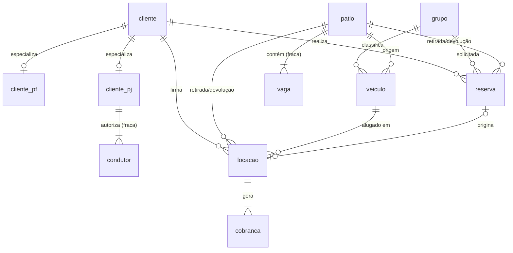

# Esquema Lógico — OLTP da Locadora de Veículos

**Trabalho:** Avaliação 01 — Parte I — Modelagem de Data Warehouse
**Grupo:**
- Gustavo Oliveira Pessanha da Silva — DRE 122051824
- André Vinícius Lobo Giron — DRE 122050404

**Método:** mapeamento ER→Relacional (7 passos de Elmasri & Navathe).

## 1. Mapeamento conceitual → tabelas

| Conceitual | Tabela(s) |
|---|---|
| Cliente (superclasse) | `cliente` |
| ClientePF | `cliente_pf` (subclasse, FK→cliente) |
| ClientePJ | `cliente_pj` (subclasse, FK→cliente) |
| Condutor (fraca de PJ) | `condutor` |
| Grupo | `grupo` |
| Veiculo | `veiculo` |
| Patio | `patio` |
| Vaga (fraca de Patio) | `vaga` |
| Reserva | `reserva` |
| Locacao | `locacao` |
| Cobranca | `cobranca` |

## 2. Passos aplicados

- **Passo 1 (entidades fortes):** `cliente`, `grupo`, `veiculo`, `patio`, `reserva`, `locacao`, `cobranca` viram tabelas com PK SERIAL.
- **Passo 2 (fracas):** `vaga` (PK composta `(patio_id, codigo)`); `condutor` (PK composta `(cliente_pj_id, cpf)`).
- **Passo 3 (1:1):** `Reserva_origina_Locacao` → FK `locacao.reserva_id` UNIQUE.
- **Passo 4 (1:N):** FK no lado N (`reserva.cliente_id`, `locacao.veiculo_id`, `cobranca.locacao_id`, etc.).
- **Passo 5 (M:N):** não há M:N nesta versão simplificada.
- **Passo 6 (multivalorados):** `cliente.telefone` simplificado para coluna única (assume-se um telefone principal).
- **Passo 7 (especialização):** estratégia 8B de E&N — uma tabela por subclasse com FK para a superclasse.

## 3. Esquema relacional (notação textual)

Legenda: **negrito** = PK; → = FK; (U) = UNIQUE; (N) = nullable.

```
cliente(id_cliente, tipo_pessoa {PF, PJ}, nome, email(U), telefone(N),
        cidade_origem, data_cadastro)

cliente_pf(cliente_id→cliente (U, PK),
           cpf(U), rg(N), data_nascimento,
           cnh_numero(U), cnh_categoria, cnh_validade)

cliente_pj(cliente_id→cliente (U, PK),
           cnpj(U), nome_fantasia(N), responsavel)

condutor(cliente_pj_id→cliente_pj, cpf, nome,
         cnh_numero(U), cnh_categoria, cnh_validade)
        [PK composta (cliente_pj_id, cpf)]

grupo(id_grupo, codigo(U), nome, classe_luxo, valor_diaria, franquia_km_diaria)

veiculo(id_veiculo, grupo_id→grupo, patio_origem_id→patio,
        placa(U), chassi(U), renavam(U),
        marca, modelo, cor, ano_fabricacao,
        mecanizacao {MANUAL, AUTOMATICA}, tem_ar_condicionado,
        km_atual, situacao {DISPONIVEL, ALUGADO, MANUTENCAO, BAIXADO})

patio(id_patio, nome, endereco, capacidade_vagas)

vaga(patio_id→patio, codigo, setor(N), ocupada)
    [PK composta (patio_id, codigo)]

reserva(id_reserva, cliente_id→cliente, grupo_id→grupo,
        patio_retirada_id→patio, patio_devolucao_id→patio,
        data_reserva, data_retirada_prevista, data_devolucao_prevista,
        estado {CONFIRMADA, EM_FILA_ESPERA, CANCELADA, CONCRETIZADA})

locacao(id_locacao, numero_contrato(U), reserva_id→reserva (U, N),
        cliente_id→cliente, veiculo_id→veiculo,
        patio_retirada_id→patio, patio_devolucao_id→patio,
        data_retirada_real, data_devolucao_real(N),
        km_saida, km_chegada(N), valor_diaria_aplicada,
        status {EM_ANDAMENTO, CONCLUIDA, CANCELADA})

cobranca(id_cobranca, locacao_id→locacao,
         data_emissao, valor_total,
         status {PENDENTE, PAGA, CANCELADA})
```

## 4. Normalização

Todas as tabelas estão em **3FN**:

- **`cliente`, `cliente_pf`, `cliente_pj`, `condutor`:** PK simples (ou composta na fraca); todos os atributos não-chave dependem só da PK. **3FN/BCNF.**
- **`grupo`, `patio`:** catálogos triviais. **BCNF.**
- **`veiculo`:** `id_veiculo → {grupo_id, marca, modelo, ...}`; sem dependências transitivas. **BCNF.**
- **`vaga`:** PK composta; dependência só da PK. **BCNF.**
- **`reserva`, `locacao`:** todas as colunas dependem da PK. **3FN.**
  - **Desnormalização consciente em `locacao.valor_diaria_aplicada`:** poderia ser derivado de `veiculo.grupo_id → grupo.valor_diaria`, mas é congelado para preservar o preço cobrado mesmo que a tarifa do grupo mude depois. Justificativa: histórico financeiro estável.
- **`cobranca`:** depende de PK; `valor_total` armazenado (poderia ser calculado a partir de `locacao` e proteções, mas mantemos por simplicidade). **3FN.**

## 5. Restrições de integridade

| ID | Regra | Mecanismo |
|---|---|---|
| R01 | `data_devolucao_prevista > data_retirada_prevista` (reserva e locacao) | CHECK |
| R02 | `km_chegada >= km_saida` (quando ambos preenchidos) | CHECK |
| R03 | Veículo em uma única locação `EM_ANDAMENTO` por vez | UNIQUE parcial / trigger |
| R04 | CNH válida na retirada | regra de negócio aplicada na aplicação |
| R05 | Domínios enumerados (`tipo_pessoa`, `mecanizacao`, `situacao`, `estado`, `status`) | CHECK IN (...) |
| R06 | Unicidade: `numero_contrato`, `placa`, `chassi`, `renavam`, `cpf`, `cnpj`, `email`, `cnh_numero` | UNIQUE |

## 6. Ações referenciais

- `ON DELETE RESTRICT` por padrão (preserva histórico de locações e cobranças).
- `ON DELETE CASCADE` apenas em fraca-forte: `condutor → cliente_pj`, `vaga → patio`, `cliente_pf/cliente_pj → cliente`.

## 7. Diagrama Mermaid



## 8. Mapeamento para os relatórios do enunciado (item 12)

| Relatório | Tabelas envolvidas |
|---|---|
| 12.a Controle de pátio (veículos por grupo e origem) | `veiculo`, `grupo`, `patio` |
| 12.b Controle das locações (por grupo, tempo restante) | `locacao`, `veiculo`, `grupo` |
| 12.c Controle de reservas (por grupo, pátio, cidade) | `reserva`, `grupo`, `patio`, `cliente` |
| 12.d Grupos mais alugados × cidade do cliente | `locacao`, `veiculo`, `grupo`, `cliente` |
| 13 Markov pátio→pátio | `locacao` (`patio_retirada_id`, `patio_devolucao_id`) |
