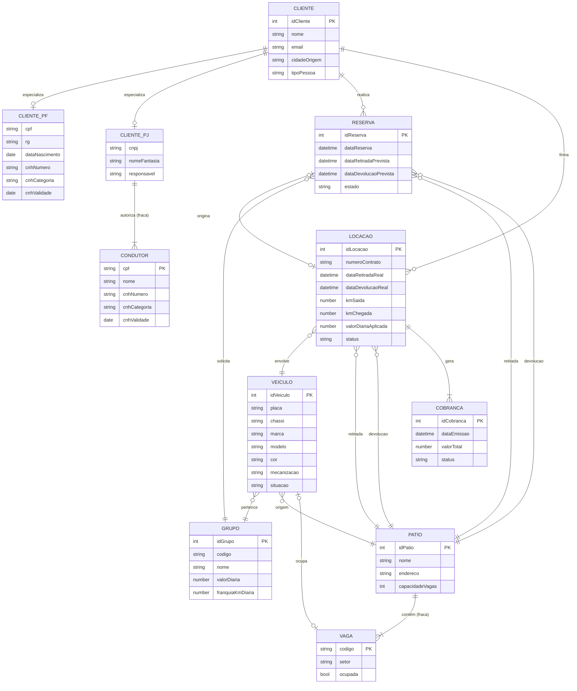

# Modelo Conceitual — OLTP da Locadora de Veículos

**Trabalho:** Avaliação 01 — Parte I — Modelagem de Data Warehouse
**Grupo:**
- Gustavo Oliveira Pessanha da Silva — DRE 122051824
- André Vinícius Lobo Giron — DRE 122050404

**Notação:** MER Estendido (Elmasri & Navathe).

## 1. Universo de Discurso

A locadora aluga veículos para clientes (pessoa física ou jurídica). Cada veículo pertence a um grupo (categoria de luxo / faixa de preço) e fica alocado em um pátio. Clientes fazem reservas e, na efetivação, abrem uma locação que registra retirada e devolução do veículo. A locação gera cobrança. Os pátios são compartilhados entre seis empresas associadas — retirada e devolução podem ocorrer em pátios diferentes.

Conceitos centrais (cinco): **Cliente, Veículo, Pátio, Reserva, Locação**, mais **Grupo** (categoria de preço) e **Cobrança**.

## 2. Entidades

1. **Cliente** (superclasse)
   - `idCliente` **PK**, `nome`, `email`, `telefone`, `cidadeOrigem`, `dataCadastro`, `tipoPessoa` (discriminador `{PF, PJ}`)

2. **ClientePF** (subclasse de Cliente)
   - `cpf`, `rg`, `dataNascimento`, `cnhNumero`, `cnhCategoria`, `cnhValidade`

3. **ClientePJ** (subclasse de Cliente)
   - `cnpj`, `nomeFantasia`, `responsavel`

4. **Condutor** — entidade fraca de ClientePJ (funcionário autorizado a dirigir)
   - `cpf` (chave parcial), `nome`, `cnhNumero`, `cnhCategoria`, `cnhValidade`

5. **Grupo**
   - `idGrupo` **PK**, `codigo`, `nome`, `classeLuxo`, `valorDiaria`, `franquiaKmDiaria`

6. **Veiculo**
   - `idVeiculo` **PK**, `placa`, `chassi`, `renavam`, `marca`, `modelo`, `cor`, `anoFabricacao`, `mecanizacao` `{MANUAL, AUTOMATICA}`, `temArCondicionado`, `kmAtual`, `situacao` `{DISPONIVEL, ALUGADO, MANUTENCAO, BAIXADO}`

7. **Patio**
   - `idPatio` **PK**, `nome`, `endereco`, `capacidadeVagas`

8. **Vaga** — entidade fraca de Patio
   - `codigo` (chave parcial), `setor`, `ocupada`

9. **Reserva**
   - `idReserva` **PK**, `dataReserva`, `dataRetiradaPrevista`, `dataDevolucaoPrevista`, `estado` `{CONFIRMADA, EM_FILA_ESPERA, CANCELADA, CONCRETIZADA}`

10. **Locacao**
    - `idLocacao` **PK**, `numeroContrato`, `dataRetiradaReal`, `dataDevolucaoReal`, `kmSaida`, `kmChegada`, `valorDiariaAplicada`, `status` `{EM_ANDAMENTO, CONCLUIDA, CANCELADA}`

11. **Cobranca**
    - `idCobranca` **PK**, `dataEmissao`, `valorTotal`, `status` `{PENDENTE, PAGA, CANCELADA}`

## 3. Relacionamentos

1. **Cliente_realiza_Reserva** — Cliente (1,1) / Reserva (0,N).
2. **Cliente_firma_Locacao** — Cliente (1,1) / Locacao (0,N).
3. **ClientePJ_autoriza_Condutor** — ClientePJ (1,N) / Condutor (1,1); identificação (fraca).
4. **Reserva_origina_Locacao** — Reserva (0,1) / Locacao (0,1); 1:1 parcial (walk-ins não vêm de reserva).
5. **Reserva_solicita_Grupo** — Reserva (1,1) / Grupo (0,N).
6. **Reserva_retirada_Patio** — Reserva (1,1) / Patio (0,N).
7. **Reserva_devolucao_Patio** — Reserva (1,1) / Patio (0,N).
8. **Locacao_envolve_Veiculo** — Locacao (1,1) / Veiculo (0,N).
9. **Locacao_retirada_Patio** — Locacao (1,1) / Patio (0,N).
10. **Locacao_devolucao_Patio** — Locacao (1,1) / Patio (0,N).
11. **Veiculo_pertence_Grupo** — Veiculo (1,1) / Grupo (1,N).
12. **Veiculo_origem_Patio** — Veiculo (1,1) / Patio (0,N) (pátio da frota proprietária).
13. **Veiculo_ocupa_Vaga** — Veiculo (0,1) / Vaga (0,1) (estado atual).
14. **Vaga_pertence_Patio** — Vaga (1,1) / Patio (1,N); identificação.
15. **Cobranca_referente_Locacao** — Cobranca (1,1) / Locacao (1,N).

## 4. Especialização

**Cliente → {ClientePF, ClientePJ}** — total, disjunta; discriminador `tipoPessoa`.
- Justificativa: identificadores naturais distintos (CPF/CNPJ) e atributos próprios (CNH em PF; razão social em PJ).
- ClientePJ tem condutores fracos (funcionários autorizados); ClientePF dirige o próprio veículo (CNH no atributo dele).

## 5. Diagrama Mermaid

## 6. Decisões de Modelagem

1. **Grupo como entidade.** Centraliza o preço (`valorDiaria`) e dá o eixo dos relatórios gerenciais (item 12 do enunciado).
2. **Especialização Cliente PF/PJ.** Disjunta e total; CPF/CNPJ e CNH justificam a divisão.
3. **Condutor como entidade fraca de ClientePJ.** PF dirige seu próprio veículo (CNH é atributo dele); PJ pode ter vários funcionários com CNHs distintas.
4. **Veículo embute marca/modelo/cor.** Simplificação consciente: não modelamos um catálogo separado de "tipos de veículo".
5. **Pátio único por evento (retirada e devolução).** Não distinguimos previsto × real — `dataRetiradaReal` e `dataDevolucaoReal` ficam nulos até o evento ocorrer.
6. **Cobrança só atrelada à Locação.** No-show e cancelamento ficam representados pelo `estado` da Reserva (sem cobrança vinculada).
7. **`valorDiariaAplicada` em Locacao.** Snapshot do preço no momento da assinatura — preserva histórico mesmo se `Grupo.valorDiaria` mudar.
8. **Vaga como fraca de Pátio.** Identificação por código alfanumérico dentro do pátio.

## 7. Regras de negócio (textuais — para a fase física)

| # | Regra |
|---|---|
| R01 | `dataDevolucaoPrevista > dataRetiradaPrevista` em Reserva e Locacao |
| R02 | `kmChegada >= kmSaida` em Locacao (quando ambos preenchidos) |
| R03 | Um veículo não pode estar em duas locações com `status = EM_ANDAMENTO` ao mesmo tempo |
| R04 | CNH do cliente PF (ou do condutor PJ que dirige) deve estar válida na data da retirada |
| R05 | Domínios enumerados conforme §2 (CHECK IN) |
| R06 | Unicidade de `numeroContrato`, `placa`, `chassi`, `renavam`, `cpf`, `cnpj`, `email` |

## 8. Suposições

- Cliente estrangeiro (sem CPF/CNPJ) está fora de escopo.
- Histórico de fotos e prontuário do veículo está fora de escopo desta Parte I (pode ser modelado em iteração futura).
- Acessórios e proteções adicionais estão fora de escopo.
- Estorno e cobrança de no-show estão fora de escopo.
