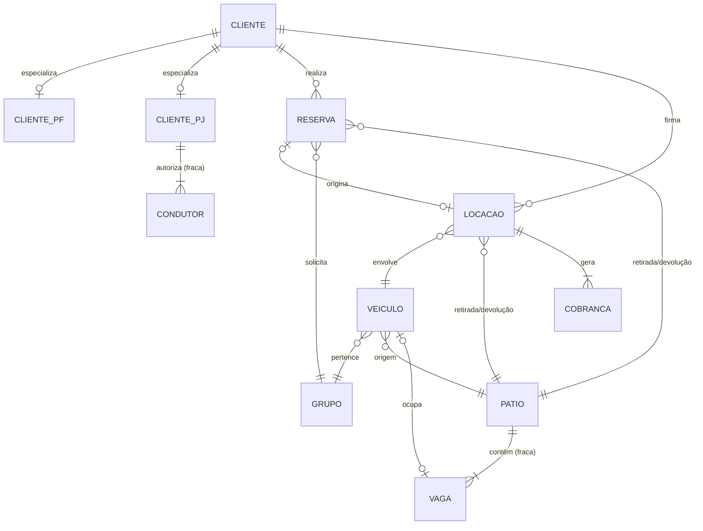

<!--
Avaliação 01 — Modelagem de DW — Parte I
Grupo:
  - Gustavo Oliveira Pessanha da Silva (DRE 122051824)
  - André Vinícius Lobo Giron (DRE 122050404)
-->

# Avaliação 01 — Modelagem de Data Warehouse — Parte I

## Projeto do Banco de Dados OLTP de uma Locadora de Veículos

---

**Disciplina:** Modelagem de Data Warehouse
**Avaliação:** 01 — Parte I

### Grupo

| Nome completo | DRE |
|---|---|
| Gustavo Oliveira Pessanha da Silva | 122051824 |
| André Vinícius Lobo Giron | 122050404 |

---

## 1. Introdução

Este relatório apresenta o projeto do banco de dados relacional para o sistema transacional (OLTP) de uma locadora de veículos. O escopo segue o enunciado: cinco conceitos centrais — **Cliente, Veículo, Pátio, Reserva e Locação** — mais **Grupo** (categoria de preço) e **Cobrança**. Sistemas auxiliares (RH, compras, fornecedores) estão fora do escopo.

A locadora faz parte de um grupo de seis empresas associadas que compartilham pátios. Por isso, retirada e devolução de um veículo podem ocorrer em pátios diferentes — modelado por dois `FK` para `patio` em `locacao` (e em `reserva`).

## 2. Descrição textual do sistema

A locadora possui uma frota de veículos. Cada veículo pertence a um **grupo** (categoria que define luxo e tarifa diária), tem placa, chassi, RENAVAM, marca, modelo, cor, ano, tipo de mecanização (manual/automática), ar-condicionado e situação (disponível, alugado, manutenção, baixado). O veículo está vinculado a um pátio de origem (frota proprietária) e pode ocupar uma vaga em algum pátio.

Os clientes são pessoas físicas ou jurídicas. Pessoas físicas dirigem o próprio veículo (CNH é atributo do cliente PF). Pessoas jurídicas autorizam **condutores** (funcionários) — modelados como entidade fraca de `cliente_pj`, com CPF e dados de CNH próprios.

A **reserva** registra a intenção do cliente de alugar um veículo de um determinado grupo, com pátios e datas previstas. Pode estar em fila de espera. Quando se concretiza, dá origem a uma **locação** (relacionamento 1:1 opcional). A locação registra os dados reais (datas, km, pátios) e congela a tarifa do grupo no momento da assinatura (`valor_diaria_aplicada`). Cada locação gera uma **cobrança**.

## 3. Modelo conceitual

Diagrama e detalhes em [`conceitual/modelo-conceitual.md`](../conceitual/modelo-conceitual.md). Resumo:

- **11 entidades:** Cliente (com especialização PF/PJ), Condutor (fraca de PJ), Grupo, Veiculo, Patio, Vaga (fraca), Reserva, Locacao, Cobranca.
- **Especialização total e disjunta** em Cliente: `{ClientePF, ClientePJ}`.
- **Relacionamentos principais:** Reserva→Cliente, Reserva→Grupo, Reserva→Patio (retirada/devolução), Locacao→Cliente, Locacao→Veiculo, Locacao→Patio (retirada/devolução), Veiculo→Grupo, Veiculo→Patio (origem), Cobranca→Locacao, Reserva↔Locacao (1:1 opcional).



### 3.1 Decisões de modelagem

1. **Grupo como entidade.** É o eixo dos relatórios gerenciais e armazena a tarifa.
2. **Cliente PF/PJ especializado.** Identificadores e atributos específicos diferentes (CPF/CNPJ; CNH apenas em PF).
3. **Condutor como entidade fraca de ClientePJ.** PF dirige o próprio carro; PJ tem múltiplos condutores autorizados.
4. **Marca/modelo/cor embutidos em Veiculo.** Decidimos não criar uma tabela separada de "tipo de veículo" para manter a modelagem enxuta.
5. **Snapshot da tarifa em Locacao** (`valor_diaria_aplicada`): preserva o histórico mesmo se `Grupo.valor_diaria` mudar depois.
6. **Cobrança ligada apenas a Locacao.** Cancelamentos e no-show ficam representados pelo `estado` da Reserva.
7. **Pátio único por evento** em Reserva e Locacao (sem distinguir previsto × real).

## 4. Modelo lógico

Detalhes e mapeamento ER→Relacional pelos 7 passos de Elmasri & Navathe em [`logico/esquema-logico.md`](../logico/esquema-logico.md). Resumo das tabelas:

`patio`, `vaga` (fraca), `grupo`, `veiculo`, `cliente`, `cliente_pf`, `cliente_pj`, `condutor` (fraca), `reserva`, `locacao`, `cobranca` — **11 tabelas**.

Estratégia para a especialização Cliente: tabela única por subclasse com FK para a superclasse (estratégia 8B do E&N cap. 9).

Todas as tabelas estão em **3FN ou superior**. A única denormalização consciente é `locacao.valor_diaria_aplicada` (snapshot de preço — justificativa em §3.1).

## 5. Modelo físico (DDL)

Script completo em [`fisico/schema.sql`](../fisico/schema.sql) (PostgreSQL, ANSI SQL:1999+).

Características do DDL:

- Tipos básicos ANSI: `SERIAL`, `INTEGER`, `VARCHAR`, `DATE`, `TIMESTAMP`, `NUMERIC`, `BOOLEAN`.
- Domínios enumerados por **`CHECK IN (...)`** (mais portável que `CREATE TYPE ENUM`).
- Restrições inline: `PRIMARY KEY`, `FOREIGN KEY` com `ON DELETE`, `UNIQUE`, `NOT NULL`, `CHECK`.
- **Índice único parcial** em `locacao(veiculo_id) WHERE status = 'EM_ANDAMENTO'` para garantir que um veículo não esteja em duas locações ativas (R03).
- **Cinco views** para os relatórios do enunciado §12 e §13.

## 6. Dicionário de Dados

Dicionário completo em [`dicionario/dicionario-dados.md`](../dicionario/dicionario-dados.md). Lista todas as tabelas com colunas (nome, tipo, restrições, descrição) e a tabela consolidada de restrições de integridade.

## 7. Restrições de integridade

| ID | Regra | Mecanismo |
|---|---|---|
| R01 | Data de devolução prevista > data de retirada prevista | `CHECK` em `reserva` e `locacao` |
| R02 | km de chegada ≥ km de saída | `CHECK` em `locacao` |
| R03 | Veículo em apenas uma locação `EM_ANDAMENTO` por vez | `UNIQUE INDEX` parcial |
| R04 | CNH válida no momento da retirada | regra de aplicação |
| R05 | Domínios enumerados (mecanizacao, situacao, estado, status, ...) | `CHECK IN (...)` |
| R06 | Unicidades naturais (placa, chassi, renavam, CPF, CNPJ, e-mail, n° contrato) | `UNIQUE` |

## 8. Atendimento aos relatórios do enunciado

| Relatório (§12 e §13 do enunciado) | View criada |
|---|---|
| 12.a Controle de pátio (veículos por grupo e pátio de origem) | `vw_veiculos_por_patio_grupo` |
| 12.b Controle das locações ativas por grupo | `vw_locacoes_em_andamento` |
| 12.c Reservas por grupo, pátio de retirada e cidade do cliente | `vw_reservas_por_grupo_patio_cidade` |
| 12.d Grupos mais alugados por cidade do cliente | `vw_grupos_alugados_por_cidade` |
| 13 Movimentação pátio→pátio (insumo Markov) | `vw_movimentacao_patio` |

## 9. Suposições e escopo

- Modelagem cobre o sistema central: cadastro, frota, pátio, reserva, locação, cobrança.
- Fora de escopo: prontuário do veículo, fotos, acessórios, proteções adicionais, no-show com cobrança, estorno, RH, compras, fornecedores.
- Cliente estrangeiro (sem CPF/CNPJ) não modelado — fora de escopo.
- Validade da CNH na retirada e bloqueio de locação para condutor sem habilitação são regras de aplicação (não impostas pelo SGBD).

## 10. Estrutura do repositório

```
locadora-dw-parte1/
├── conceitual/    # modelo conceitual (MER/EER em Mermaid + texto)
├── logico/        # esquema lógico (mapeamento ER→Relacional)
├── fisico/        # script DDL (PostgreSQL)
├── dicionario/    # dicionário de dados
├── docs/          # este relatório, enunciado, folha de rosto, grupo
├── arquivo/       # versões anteriores arquivadas (não submetidas)
└── README.md
```
