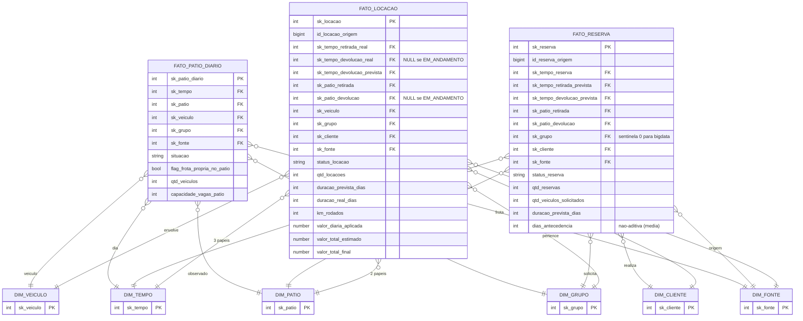

<!--
Avaliação 02 — Modelagem de DW — Parte II
Grupo:
  - Gustavo Oliveira Pessanha da Silva (DRE 122051824)
  - André Vinícius Lobo Giron (DRE 122050404)
-->

---
title: "Avaliação 02 — Parte II: Modelo Dimensional Estrela"
subtitle: "Modelagem de Data Warehouse — EEL890 (UFRJ)"
lang: pt-BR
---

# Capa

**Universidade Federal do Rio de Janeiro (UFRJ)**
**Disciplina:** Modelagem de Data Warehouse — EEL890
**Avaliação:** 02 — Parte II — Projeto de DW e ETL Integrado
**Título:** Avaliação 02 — Modelagem de Data Warehouse — Parte II: Modelo Dimensional Estrela
**Tema:** Locadora de veículos — pátios compartilhados entre seis empresas associadas

## Grupo

| Nome completo | DRE |
|---|---|
| Gustavo Oliveira Pessanha da Silva | 122051824 |
| André Vinícius Lobo Giron | 122050404 |

**Data de entrega:** 2026-05-30
**Repositório GitHub:** `<a definir>` (preencher após `git push` final)

\newpage

# 1. Introdução

Este relatório descreve o **modelo dimensional estrela** projetado para o Data Warehouse (DW) que integra cinco sistemas operativos (OLTP) heterogêneos de uma associação de seis locadoras de veículos. As locadoras compartilham seis pátios — Aeroporto do Galeão, Aeroporto Santos Dumont, Rodoviária do Rio, Shopping Rio Sul, Shopping Nova América e Barra Shopping — e cada uma mantém seu próprio sistema transacional. A integração via DW único viabiliza os quatro relatórios gerenciais globais exigidos pelo enunciado e a análise de previsão de ocupação por **cadeia de Markov**.

Das seis fontes-candidatas disponíveis na turma, **cinco foram selecionadas** e integradas: `locadora-dw-parte1` (Parte I do próprio grupo), `mae016`, `locadora-db`, `bd-dw-26-1` e `bigdata`. As três fontes excluídas (e os motivos técnicos da exclusão) são documentadas no relatório complementar `docs/relatorio-etl.pdf`, §4. A escolha das cinco fontes integradas privilegia esquemas que expõem, de forma recuperável, todos os atributos exigidos pelos quatro relatórios gerenciais — em particular: pátio de devolução real, cidade do cliente e grupo/categoria do veículo.

Este documento cobre **exclusivamente o modelo dimensional**: bus matrix Kimball, fatos, dimensões, conformação de chaves, decisões de modelagem, ligação fonte→DW e considerações analíticas. O **processo ETL** (extração, transformação, carga, problemas encontrados, conclusão geral) é descrito no relatório irmão `docs/relatorio-etl.pdf`. Ambos compõem a entrega obrigatória da Parte II.

Fundamentação metodológica: Kimball & Ross, *The Data Warehouse Toolkit*, 3ª edição (caps. 1, 5, 6 e 7) e Elmasri & Navathe, *Sistemas de Banco de Dados*, 7ª edição (caps. 29 e 30 — OLAP e Data Warehousing).

\newpage

# 2. Fontes consumidas

Cinco esquemas OLTP foram integrados, cada um em um *schema* PostgreSQL separado dentro do cluster único do DW:

| # | Grupo autor | `sk_fonte` | Schema Postgres alvo | SGBD original | Principais tabelas usadas |
|---|---|---|---|---|---|
| 1 | Gustavo + André (própria Parte I) | 1 | `src_andre_gustavo` | PostgreSQL | `cliente`, `cliente_pf`, `cliente_pj`, `veiculo`, `grupo`, `patio`, `reserva`, `locacao`, `condutor` |
| 2 | Breno, Hygor, João (MAE016) | 2 | `src_mae016` | MySQL→Postgres | `CLIENTE`, `VEICULO`, `GRUPO_VEICULO`, `PATIO`, `RESERVA`, `LOCACAO`, `MOVIMENTACAO_PATIO`, `CONDUTOR` |
| 3 | Tadeu, Vicente (Locadora-DB) | 3 | `src_locadora_db` | PostgreSQL | `cliente`, `veiculo`, `grupo_veiculo`, `patio`, `reserva`, `locacao`, `condutor`, `movimentacao_patio` |
| 4 | Ana Clara, Mariana, Matheus, Paulo, Pedro, Ryan (BD-DW-26.1) | 4 | `src_bd_dw_26_1` | MySQL→Postgres | `Cliente`, `Cliente_pf`, `Cliente_pj`, `Veiculo`, `Categoria`, `Patio`, `Endereco`, `Reserva`, `Locacao`, `Motorista` |
| 5 | Modelagem ANSI normalizada (BigData) | 5 | `src_bigdata` | ANSI SQL | `PessoaFisica`, `Empresa`, `Veiculo`, `Categoria`, `Patio`, `Endereco`, `Vaga`, `Reserva`, `Locacao`, `CentroCusto`, `Motorista`, `Movimentacao` |

Os DDLs originais em MySQL (fontes 2 e 4) foram traduzidos manualmente para PostgreSQL preservando a semântica e a integridade referencial (sintaxe ANSI SQL:1999+ + extensões Postgres pontuais comentadas). A staging area unifica esses cinco esquemas heterogêneos em sete tabelas `staging.stg_*` (patio, grupo, veiculo, cliente, reserva, locacao, movimentacao_patio), e o DW final reside no schema `dw` com seis dimensões conformadas (`dim_*`) e três fatos (`fato_*`).

\newpage

# 3. Visão geral do esquema estrela

O DW comporta **três fatos** e **seis dimensões conformadas**, organizados segundo a metodologia de Kimball. Os fatos cobrem os três processos de negócio modelados: locação efetivada, reserva (intenção anterior) e estoque diário de pátio.

## 3.1 Bus matrix Kimball

A tabela a seguir documenta a integração dos três processos em torno das seis dimensões conformadas. Cada `X` indica participação da dimensão no fato; quando uma dimensão atua em mais de um papel (*role-playing*), os papéis são listados.

| Processo de negócio (fato) | `dim_tempo` | `dim_patio` | `dim_veiculo` | `dim_grupo` | `dim_cliente` | `dim_fonte` |
|---|---|---|---|---|---|---|
| **Locação** (`fato_locacao`) | X (retirada real, devolução real, devolução prevista) | X (retirada, devolução) | X | X | X | X |
| **Reserva** (`fato_reserva`) | X (reserva, retirada prevista, devolução prevista) | X (retirada, devolução) | — (reserva é por grupo) | X (sentinela para `bigdata`) | X | X |
| **Estoque de pátio** (`fato_patio_diario`) | X (dia do snapshot) | X (pátio observado) | X (granularidade por veículo — habilita corte por marca/modelo/mecanização) | X (desnormalizado a partir de `dim_veiculo`) | — | X (origem da frota) |

A dimensão `dim_fonte` participa de todos os três fatos porque toda métrica deve ser rastreável até o sistema operativo de origem — exigência implícita do enunciado ao falar em "integração das fontes de dados escolhidas". Em `fato_patio_diario`, `dim_fonte` realiza dupla função: identifica tanto o sistema que reportou o snapshot quanto a empresa proprietária da frota observada, viabilizando o recorte "frota da empresa dona vs. das outras associadas" exigido no relatório (a).

## 3.2 Síntese dos fatos

| Fato | Tipo Kimball | Grão | Relatórios servidos |
|---|---|---|---|
| `fato_locacao` | Transação | Uma locação | (b), (d), Markov |
| `fato_reserva` | Transação | Uma reserva | (c) |
| `fato_patio_diario` | Snapshot periódico | Veículo × dia | (a) |

## 3.3 Síntese das dimensões

| Dimensão | Cardinalidade esperada | SCD | Descrição sintética |
|---|---|---|---|
| `dim_tempo` | 4 019 (4 018 dias + 1 sentinela) | N/A | Calendário 2020-01-01 a 2030-12-31, *smart-key* `YYYYMMDD` |
| `dim_patio` | 7 (6 canônicos + 1 sentinela) | Tipo 1 | Seis pátios conformados do enunciado |
| `dim_veiculo` | 10²-10³ | Tipo 1 | Granularidade por placa por fonte (sem dedup *cross-fonte*) |
| `dim_grupo` | 10¹ + 1 sentinela | Tipo 1 | Categorias normalizadas (ECONOMICO, COMPACTO, ...) |
| `dim_cliente` | 10³-10⁴ | Tipo 1 | Clientes por fonte (sem dedup *cross-fonte*) |
| `dim_fonte` | 6 (5 fontes reais + 1 sentinela) | Tipo 1 | Cadastro das fontes/empresas associadas |

## 3.4 Diagrama Mermaid do esquema estrela

A figura a seguir resume a estrela. Cada `}o--||` indica uma relação fato-dimensão (vários eventos por linha de dimensão). Papéis múltiplos para `dim_tempo` e `dim_patio` (role-playing) aparecem como FKs múltiplas dentro do fato.



O diagrama completo, com todas as colunas e atributos das dimensões, está em `dimensional/diagrama-estrela.md`.

\newpage

# 4. Fatos detalhados

## 4.1 `fato_locacao`

- **Processo de negócio:** locação efetivada (contrato de aluguel).
- **Grão:** uma linha por locação registrada em qualquer das cinco fontes-origem.
- **Tipo:** *Transaction Fact Table* (Kimball cap. 1).
- **Dimensões referenciadas:**
  - `sk_tempo_retirada_real`, `sk_tempo_devolucao_real`, `sk_tempo_devolucao_prevista` (role-playing de `dim_tempo`)
  - `sk_patio_retirada`, `sk_patio_devolucao` (role-playing de `dim_patio`)
  - `sk_veiculo`, `sk_grupo`, `sk_cliente`, `sk_fonte`

### Métricas

| Métrica | Classificação | Definição |
|---|---|---|
| `qtd_locacoes` | aditiva | Contador degenerado fixo em 1 por linha. |
| `duracao_prevista_dias` | aditiva | Dias entre retirada e devolução prevista. |
| `duracao_real_dias` | aditiva | Dias entre retirada e devolução real (NULL para `EM_ANDAMENTO`). |
| `km_rodados` | aditiva | `km_devolucao − km_retirada`. |
| `valor_diaria_aplicada` | não-aditiva | Tarifa congelada no momento da locação (usar média ponderada). |
| `valor_total_estimado` | aditiva | `valor_diaria × duracao_prevista` quando a fonte não fornece o total. |
| `valor_total_final` | aditiva | Valor cobrado ao final da locação. |

### Atributos degenerados

- `id_locacao_origem` BIGINT — PK numérica da locação na fonte; auditoria reversa em 5/5 fontes (MOD-04).
- `numero_contrato_fonte` VARCHAR(50) — somente `andre_gustavo` expõe; NULL em 4/5 fontes.
- `status_locacao` — domínio `{EM_ANDAMENTO, CONCLUIDA, CANCELADA, DESCONHECIDO}`.

### Regras especiais

- `sk_tempo_devolucao_real` é **NULL** para locações `EM_ANDAMENTO` (Kimball cap. 6, "Null Foreign Keys" — preserva semântica "ainda não ocorreu").
- `sk_patio_devolucao` corresponde sempre ao **real** quando a fonte distingue previsto vs realizado (MOD-05). NULL se locação ainda não devolvida.

### Relatórios servidos

- (b) Controle de locações.
- (d) Grupos mais alugados × cidade do cliente.
- **Matriz Markov** (agregação `(sk_patio_retirada, sk_patio_devolucao)` para `status_locacao = 'CONCLUIDA'` — decisão D-09).

### Ligação fonte → `fato_locacao`

| Coluna do fato | `andre_gustavo` | `mae016` | `locadora_db` | `bd_dw_26_1` | `bigdata` |
|---|---|---|---|---|---|
| `id_locacao_origem` | `locacao.id_locacao` | `LOCACAO.id_locacao` | `locacao.id` | `Locacao.Id_locacao` | `Locacao.IDLocacao` |
| `numero_contrato_fonte` | `locacao.numero_contrato` | NULL | NULL | NULL | NULL |
| `sk_tempo_retirada_real` | `locacao.data_retirada_real` | `LOCACAO.data_hora_retirada` | `locacao.data_retirada_realizada` | `Locacao.Data_hora_retirada_real` | `Locacao.DtRetirada` |
| `sk_tempo_devolucao_real` | `locacao.data_devolucao_real` | `LOCACAO.data_hora_real_devolucao` | `locacao.data_devolucao_realizada` | `Locacao.Data_hora_devolucao_real` | `Locacao.DtChegada` |
| `sk_tempo_devolucao_prevista` | `data_retirada + 5d` (heurístico) | `LOCACAO.data_hora_prev_devolucao` | `locacao.data_devolucao_prevista` | `Reserva.Data_previsao_devolucao` (via stub) | `DtRetirada + 5d` (heurístico) |
| `sk_patio_retirada` | `locacao.patio_retirada_id` | `LOCACAO.id_patio_retirada` | `locacao.patio_retirada_id` | `Locacao.Id_patio_real_retirada` | `Vaga.IDPatio` via `IDVagaRetirada` |
| `sk_patio_devolucao` | `locacao.patio_devolucao_id` (se devolvido) | `LOCACAO.id_patio_devolucao_real` | `locacao.patio_devolucao_id` (se devolvido) | `Locacao.Id_patio_real_devolucao` | `Vaga.IDPatio` via `IDVagaDevolvida` |
| `sk_veiculo` | `locacao.veiculo_id` | `LOCACAO.id_veiculo` | `locacao.veiculo_id` | `Locacao.Id_veiculo` | `Locacao.IDVeiculo` |
| `sk_grupo` | `veiculo.grupo_id` | `VEICULO.id_grupo` | `veiculo.grupo_id` | `Veiculo.Id_categoria` | `Veiculo.IDCategoria` |
| `sk_cliente` | `locacao.cliente_id` | `LOCACAO.id_cliente` | `condutor.cliente_id` (via `locacao.condutor_id`) | `Motorista.Id_cliente` | `'PF_' || Motorista.IDFisica` |
| `valor_diaria_aplicada` | `locacao.valor_diaria_aplicada` | NULL | NULL | NULL | `Locacao.ValorDiaria` |
| `valor_total_final` | NULL | `LOCACAO.valor_final` | NULL | `Locacao.Valor_total_final` | NULL |
| `km_rodados` | derivado | NULL | derivado | derivado | NULL |

## 4.2 `fato_reserva`

- **Processo de negócio:** reserva (intenção anterior, ou simultânea em walk-in).
- **Grão:** uma linha por reserva registrada em qualquer das cinco fontes-origem.
- **Tipo:** *Transaction Fact Table*.
- **Dimensões referenciadas:** `sk_tempo_reserva`, `sk_tempo_retirada_prevista`, `sk_tempo_devolucao_prevista`, `sk_patio_retirada`, `sk_patio_devolucao`, `sk_grupo`, `sk_cliente`, `sk_fonte`.

### Métricas

| Métrica | Classificação | Definição |
|---|---|---|
| `qtd_reservas` | aditiva | Contador degenerado fixo em 1. |
| `qtd_veiculos_solicitados` | aditiva | Número de veículos pedidos (`bigdata` expõe; demais defaultam a 1). |
| `duracao_prevista_dias` | aditiva | Dias entre retirada e devolução previstas. |
| `dias_antecedencia` | **não-aditiva** | Dias entre data da reserva e data prevista de retirada (reclassificada após MOD-01). |
| `valor_previsto` | aditiva | Valor estimado da reserva (quando exposto). |

### Atributos degenerados

- `id_reserva_origem` BIGINT — PK numérica da reserva na fonte (5/5 fontes).
- `status_reserva` — domínio `{CONFIRMADA, EM_FILA_ESPERA, CANCELADA, CONCRETIZADA, DESCONHECIDO}`.

### Regras especiais

- Reservas da fonte `bigdata` (sem `IDCategoria` em `Reserva` — CRÍTICO-04, P-10) recebem `sk_grupo = 0` (sentinela `GRUPO_NAO_INFORMADO`).
- Relatório (c) filtra por padrão `status_reserva IN ('CONFIRMADA','EM_FILA_ESPERA','CONCRETIZADA')` — exclui `CANCELADA` (MOD-06).

### Relatórios servidos

- (c) Controle de reservas por grupo, pátio de retirada, antecedência e cidade do cliente.

### Ligação fonte → `fato_reserva`

| Coluna do fato | `andre_gustavo` | `mae016` | `locadora_db` | `bd_dw_26_1` | `bigdata` |
|---|---|---|---|---|---|
| `id_reserva_origem` | `reserva.id_reserva` | `RESERVA.id_reserva` | `reserva.id` | `Reserva.Id_reserva` (≤100) | `Reserva.IDReserva` (≤100) |
| `sk_tempo_reserva` | `reserva.data_reserva` | `RESERVA.data_reserva` | `reserva.data_inicio` | `Reserva.Data_hora_reserva` | `Reserva.DtReserva` |
| `sk_tempo_retirada_prevista` | `reserva.data_retirada_prevista` | `RESERVA.data_prev_retirada` | `reserva.data_inicio` | `Reserva.Data_previsao_retirada` | `Reserva.DtRetiradaPrevista` |
| `sk_tempo_devolucao_prevista` | `reserva.data_devolucao_prevista` | `RESERVA.data_prev_devolucao` | `reserva.data_fim` | `Reserva.Data_previsao_devolucao` | `Reserva.DtLimiteRetirada` |
| `sk_patio_retirada` | `reserva.patio_retirada_id` | `RESERVA.id_patio_retirada` | `reserva.patio_retirada_id` | `Reserva.Id_patio_previsto_retirada` | sentinela pátio dono |
| `sk_patio_devolucao` | `reserva.patio_devolucao_id` | `RESERVA.id_patio_devolucao_previsto` | `reserva.patio_devolucao_id` | `Reserva.Id_patio_previsto_devolucao` | sentinela pátio dono |
| `sk_grupo` | `reserva.grupo_id` | `RESERVA.id_grupo` | `reserva.grupo_id` | `Reserva.Id_categoria` | **sentinela 0** (P-10) |
| `sk_cliente` | `reserva.cliente_id` | `RESERVA.id_cliente` | `reserva.cliente_id` | `Reserva.Id_cliente` | `CentroCusto.IDFisica`/`IDEmpresa` |
| `qtd_veiculos_solicitados` | 1 (default) | 1 (default) | 1 (default) | 1 (default) | `Reserva.QtVeiculosSolicitados` |
| `valor_previsto` | NULL | NULL | NULL | `Reserva.Valor_previsto` | NULL |

## 4.3 `fato_patio_diario`

- **Processo de negócio:** presença diária de cada veículo da frota em algum pátio.
- **Grão:** **uma linha por veículo por dia** (corrigido após CRÍTICO-01/CRÍTICO-02). Veículos baixados ou sem cadastro no dia não geram linha.
- **Tipo:** *Periodic Snapshot Fact Table* (Kimball cap. 7) na variante "por entidade individual" — escolha que habilita o agrupamento por marca/modelo/mecanização exigido no relatório (a).
- **Dimensões referenciadas:** `sk_tempo`, `sk_patio`, `sk_veiculo`, `sk_grupo`, `sk_fonte`.

### Atributos degenerados

- `situacao` — domínio `{DISPONIVEL, ALUGADO, MANUTENCAO, RESERVADO}`. Pivot por colunas é feito na consulta via `COUNT(*) FILTER (WHERE situacao = X)`.
- `flag_frota_propria_no_patio` BOOLEAN — `TRUE` quando `sk_fonte` do veículo coincide com `codigo_fonte_dona` do pátio observado. Habilita o relatório (a) "frota dona × associadas" sem JOIN adicional.

### Métricas

| Métrica | Classificação | Definição |
|---|---|---|
| `qtd_veiculos` | aditiva (exceto tempo) / semi-aditiva no tempo | Contador fixo = 1 por linha. Somar entre dias conta o mesmo veículo várias vezes; usar `AVG`, `MIN`, `MAX` no eixo temporal. |
| `capacidade_vagas_patio` | semi-aditiva | Capacidade replicada do pátio para evitar JOIN no relatório (a). |

### Cardinalidade

~4 018 dias × ~100 veículos (seed sintético) ≈ ~400 mil linhas. Em produção, milhões. Particionamento natural por `sk_tempo` (ano) se necessário.

### Relatórios servidos

- (a) Controle de pátio — atende plenamente o agrupamento por grupo, marca, modelo, mecanização (via JOIN com `dim_veiculo`) e origem (via `flag_frota_propria_no_patio` ou JOIN com `dim_fonte`).

### Ligação fonte → `fato_patio_diario`

`fato_patio_diario` é **derivado** pelo ETL (não há fonte que tenha snapshot diário nativo). Para cada `(veículo, dia)`:

- `sk_veiculo`, `sk_grupo`, `sk_fonte`, `capacidade_vagas_patio` vêm de `dim_veiculo` + `dim_patio`.
- `situacao = 'ALUGADO'` se existe locação em `fato_locacao` cobrindo o dia (com desempate determinístico — vide CRÍTICO-02 da revisão ETL).
- `situacao = 'MANUTENCAO'` se `dim_veiculo.situacao_atual = 'MANUTENCAO'` e nenhuma locação cobre o dia.
- `situacao = 'DISPONIVEL'` caso contrário.
- `sk_patio` = pátio de retirada da locação que cobre o dia (se `ALUGADO`); senão pátio de origem do veículo (via `stg_veiculo.nome_canonico_patio`).
- `flag_frota_propria_no_patio` = (`dim_fonte.codigo_fonte` do veículo == `dim_patio.codigo_fonte_dona`).

\newpage

# 5. Dimensões detalhadas

## 5.1 `dim_tempo`

- **Chave subrogada:** `sk_tempo` INTEGER — *smart-key* `YYYYMMDD` (ex.: `20250530`).
- **Chave natural:** a data em si (não há OLTP com tabela de tempo).
- **Atributos:** `data_completa`, `ano`, `semestre`, `trimestre`, `bimestre`, `mes_numero`, `mes_nome`, `mes_abreviado`, `semana_ano`, `dia_mes`, `dia_ano`, `dia_semana_numero`, `dia_semana_nome`, `eh_fim_de_semana`, `eh_feriado_nacional`, `descricao_periodo`.
- **SCD:** não se aplica.
- **Cardinalidade:** 4 018 datas (2020-01-01 a 2030-12-31, com bissextos 2020/2024/2028) + 1 sentinela `sk_tempo = 19000101` = **4 019 linhas**.
- **Fonte de feriados:** Lei 662/1949 + Lei 6.802/1980 + Lei 10.607/2002 (8 feriados nacionais fixos por ano). Não modelamos feriados móveis (Carnaval, Sexta Santa, Corpus Christi).
- **Ligação fonte → `dim_tempo`:** não há (dimensão pré-populada via função `popular_dim_tempo()` em `dw/02_dim_tempo_carga.sql`).

## 5.2 `dim_patio`

- **Chave subrogada:** `sk_patio` SERIAL (IDENTITY).
- **Chave natural:** `nome_canonico` (UNIQUE) — string normalizada.
- **Atributos:** `nome_canonico`, `apelido`, `tipo_local` (`AEROPORTO`/`RODOVIARIA`/`SHOPPING`/`DESCONHECIDO`), `cidade`, `endereco_descritivo`, `capacidade_vagas_referencia`, `flag_funciona_24h`, `codigo_fonte_dona`.
- **SCD:** tipo 1.
- **Justificativa SCD-1:** o conjunto é fechado em seis pátios; mudanças de capacidade/endereço são raras e irrelevantes para os relatórios.
- **Cardinalidade:** 6 + 1 sentinela `PATIO_DESCONHECIDO`.

### Os 6 pátios canônicos

| `nome_canonico` | `apelido` | `tipo_local` | `codigo_fonte_dona` |
|---|---|---|---|
| `AEROPORTO_GALEAO` | Galeão | AEROPORTO | `andre_gustavo` |
| `AEROPORTO_SANTOS_DUMONT` | Santos Dumont | AEROPORTO | `mae016` |
| `RODOVIARIA_RIO` | Rodoviária | RODOVIARIA | `locadora_db` |
| `SHOPPING_RIO_SUL` | Rio Sul | SHOPPING | `bd_dw_26_1` |
| `SHOPPING_NOVA_AMERICA` | Nova América | SHOPPING | `bigdata` |
| `SHOPPING_BARRA` | Barra | SHOPPING | NULL (P-07 — sexta empresa sem sistema-fonte) |

### Ligação fonte → `dim_patio`

A reconciliação é mediada pela tabela `staging.depara_patio (sk_fonte, id_natural_origem) → nome_canonico`. As variantes textuais aceitas em cada fonte são:

| Fonte | Tabela | Coluna do nome | Caminho até cidade |
|---|---|---|---|
| `andre_gustavo` | `patio` | `nome` | `'Rio de Janeiro'` hardcoded |
| `mae016` | `PATIO` | `nome_patio` | `'Rio de Janeiro'` hardcoded |
| `locadora_db` | `patio` | `nome` | `patio.cidade` |
| `bd_dw_26_1` | `Patio` | `Nome_patio` | JOIN com `Endereco` via `Id_endereco` |
| `bigdata` | `Patio` | `CDPatio` | JOIN com `Endereco` via `IDEndereco` |

## 5.3 `dim_veiculo`

- **Chave subrogada:** `sk_veiculo` IDENTITY.
- **Chave natural:** par `(sk_fonte_origem, id_natural_origem)` — UNIQUE composto.
- **Atributos:** `placa`, `chassi`, `renavam`, `marca`, `modelo`, `cor`, `ano_fabricacao`, `mecanizacao`, `tem_ar_condicionado`, `tem_adaptacao_cadeirante`, `capacidade_pessoas`, `capacidade_porta_malas`, `categoria_dimensoes`, `situacao_atual`.
- **SCD:** tipo 1.
- **Justificativa SCD-1:** atributos de um veículo individual são essencialmente estáticos; o único realmente volátil é `situacao_atual`, e esse histórico vive nos fatos (`fato_locacao`, `fato_patio_diario`).

### Ligação fonte → `dim_veiculo`

| Coluna da dim | `andre_gustavo` | `mae016` | `locadora_db` | `bd_dw_26_1` | `bigdata` |
|---|---|---|---|---|---|
| `id_natural_origem` | `veiculo.id_veiculo` | `VEICULO.id_veiculo` | `veiculo.id` | `Veiculo.Id_veiculo` | `Veiculo.IDVeiculo` |
| `placa` | `placa` | `placa` | `placa` | `Placa` | `Placa` |
| `marca` | `marca` | `marca` | `marca` | `Marca` | NULL |
| `modelo` | `modelo` | `modelo` | `modelo` | `Modelo` | `Modelo` |
| `mecanizacao` | `mecanizacao` | `mecanizacao` (`AUTOMATICO`→`AUTOMATICA`) | `tipo_mecanizacao` | `Tipo_cambio` (mapeado) | `'DESCONHECIDA'` |
| `tem_ar_condicionado` | `tem_ar_condicionado` | `ar_condicionado` | `ar_condicionado` | `Possui_ar_condicionado` | `ArCondicionado` |

## 5.4 `dim_grupo`

- **Chave subrogada:** `sk_grupo` IDENTITY.
- **Chave natural:** `nome_grupo_normalizado` (UNIQUE).
- **Atributos:** `nome_grupo_normalizado`, `codigo_curto`, `classe_luxo`, `valor_diaria_referencia`, `franquia_km_diaria_referencia`, `descricao`.
- **SCD:** tipo 1.
- **Sentinela:** `sk_grupo = 0` `GRUPO_NAO_INFORMADO` — destino das reservas da `bigdata` (CRÍTICO-04, P-10).
- **Cálculo de `valor_diaria_referencia` (LEVE-05):** média aritmética simples das 4 fontes que expõem preço (`andre_gustavo`, `mae016`, `bd_dw_26_1`, `bigdata`); `locadora_db` não expõe preço.

### Ligação fonte → `dim_grupo`

| Fonte | Tabela | Coluna do nome | Coluna do preço |
|---|---|---|---|
| `andre_gustavo` | `grupo` | `nome` | `valor_diaria` |
| `mae016` | `GRUPO_VEICULO` | `nome_grupo` | `faixa_valor_diaria` |
| `locadora_db` | `grupo_veiculo` | `nome` | — (não expõe) |
| `bd_dw_26_1` | `Categoria` | `Nome_categoria` | `Valor_diaria_base` |
| `bigdata` | `Categoria` | `Classificacao` | `ValorDiariaBase` |

## 5.5 `dim_cliente`

- **Chave subrogada:** `sk_cliente` IDENTITY.
- **Chave natural:** par `(sk_fonte_origem, id_natural_origem)` — UNIQUE composto. **Sem dedup *cross-fonte*** (decisão D-03).
- **Atributos:** `tipo_pessoa` (PF/PJ), `nome`, `nome_fantasia`, `cidade_origem`, `uf_origem`, `email`, `telefone`, `cpf_normalizado`, `cnpj_normalizado`, `flag_eh_pessoa_juridica`.
- **SCD:** tipo 1.

### Ligação fonte → `dim_cliente`

| Fonte | Tabela | Caminho para `cidade_origem` |
|---|---|---|
| `andre_gustavo` | `cliente` (+ `cliente_pf`, `cliente_pj`) | `cliente.cidade_origem` direto |
| `mae016` | `CLIENTE` | `CLIENTE.cidade` direto |
| `locadora_db` | `cliente` | `cliente.cidade` direto |
| `bd_dw_26_1` | `Cliente` (+ `Cliente_pf`, `Cliente_pj`) | JOIN com `Endereco` via `Id_endereco` |
| `bigdata` | UNION ALL: `PessoaFisica` ∪ `Empresa` | JOIN com `Endereco` via `IDEndereco`; `id_natural = 'PF_'||IDFisica` ou `'PJ_'||IDEmpresa` |

## 5.6 `dim_fonte`

- **Chave subrogada:** `sk_fonte` SMALLINT (atribuída manualmente, estável `0..5`).
- **Chave natural:** `codigo_fonte` (UNIQUE) — slug curto.
- **Atributos:** `codigo_fonte`, `nome_empresa_associada`, `sgbd_original` (`POSTGRES`/`MYSQL`/`ANSI`), `descricao`.
- **SCD:** tipo 1 (na prática, estática).
- **Cardinalidade:** 5 reais + 1 sentinela = 6 linhas.

### As 5 fontes + sentinela

| `sk_fonte` | `codigo_fonte` | `nome_empresa_associada` | `sgbd_original` |
|---|---|---|---|
| 0 | `FONTE_DESCONHECIDA` | Fonte desconhecida (sentinela) | N/A |
| 1 | `andre_gustavo` | Grupo Gustavo + André | POSTGRES |
| 2 | `mae016` | Grupo MAE016 (Breno, Hygor, João) | MYSQL |
| 3 | `locadora_db` | Grupo Locadora-DB (Tadeu, Vicente) | POSTGRES |
| 4 | `bd_dw_26_1` | Grupo BD-DW-26.1 (Ana, Mariana, +) | MYSQL |
| 5 | `bigdata` | Grupo BigData | ANSI |

\newpage

# 6. Conformação de chaves

Esta seção documenta o *de-para* por dimensão. Toda normalização ocorre no ETL Transform; aqui declaramos o alvo conformado.

## 6.1 `dim_patio` — seis pátios canônicos

A reconciliação é mediada por `staging.depara_patio (sk_fonte, id_natural_origem) → nome_canonico` populada pelo seed em `staging/04_tabelas_de_para.sql`. Tabela de variantes esperadas:

| `nome_canonico` | Variantes textuais nas fontes |
|---|---|
| `AEROPORTO_GALEAO` | "Aeroporto do Galeão", "Galeão", "GIG", "Aeroporto Internacional" |
| `AEROPORTO_SANTOS_DUMONT` | "Santos Dumont", "SDU" |
| `RODOVIARIA_RIO` | "Rodoviária do Rio", "Rodoviária Novo Rio", "Rodoviária" |
| `SHOPPING_RIO_SUL` | "Shopping Rio Sul", "Rio Sul", "Botafogo" |
| `SHOPPING_NOVA_AMERICA` | "Shopping Nova América", "NAM" |
| `SHOPPING_BARRA` | "Barra Shopping", "BarraShopping", "BRR" |

Linhas das fontes que não casarem com nenhum canônico são desviadas para fila de exceção (não entram nos fatos).

## 6.2 `dim_grupo` — lista canônica normalizada

Mediada por `staging.depara_grupo (sk_fonte, codigo_origem) → nome_canonico`. A lista canônica derivada na fase ETL é subconjunto de: `ECONOMICO`, `COMPACTO`, `INTERMEDIARIO`, `SEDAN`, `SUV`, `UTILITARIO`, `LUXO`, `PREMIUM`, `MINIVAN`, plus a sentinela `GRUPO_NAO_INFORMADO`.

## 6.3 `dim_cliente` — política de não-dedup *cross-fonte*

`sk_cliente` é gerada por `(sk_fonte, id_natural_na_fonte)`. **Não fazemos dedup global por CPF/CNPJ.** Justificativa (D-03):

1. A fonte `locadora_db` **não expõe CPF nem CNPJ** — clientes dela jamais seriam deduplicáveis, gerando dedup parcial heterogênea.
2. O enunciado não exige dedup; somar duplamente um cliente entre duas fontes não é erro semântico — reflete que o mesmo CPF é cliente de duas empresas associadas.
3. Dedup *cross-fonte* introduz dependência de ordem de carga e complica auditoria.

## 6.4 `dim_veiculo` — granularidade por placa por fonte

Mesma política de `dim_cliente`: `sk_veiculo` por `(sk_fonte, placa_normalizada)`. Sem dedup *cross-fonte*. Veículos com mesma placa em duas fontes (cenário improvável no seed) ficam como duas linhas distintas, garantindo que a contagem em `fato_patio_diario` casa exatamente com a contagem do OLTP de cada empresa.

## 6.5 `dim_tempo` — smart-key `YYYYMMDD`

A chave inteira `YYYYMMDD` é:

- **Legível** ao olho humano em qualquer SELECT de fato (debugging).
- **Ordenável naturalmente:** `WHERE sk_tempo BETWEEN 20250101 AND 20251231` filtra todo o ano sem JOIN à dimensão.
- **Estável:** não depende de ordem de carga (diferente de SERIAL).
- **Suporta sentinela** `sk_tempo = 19000101` para "data desconhecida".

## 6.6 `dim_fonte` — cadastro fixo

Sem conformação aplicável: `dim_fonte` é cadastro fixo conhecido a priori, com `sk_fonte` atribuída manualmente em `etl/07_load_dimensoes.sql`.

\newpage

# 7. Decisões de modelagem

## D-01. Três fatos em vez de um único fato "atividade"

- **Decisão:** decompor o universo em três tabelas de fato (`fato_locacao`, `fato_reserva`, `fato_patio_diario`).
- **Alternativa:** um único `fato_atividade` com discriminador `tipo_evento`.
- **Justificativa (Kimball cap. 1, "Common Mistakes" #5):** os três processos têm **grãos diferentes** e **tipos diferentes** (duas transações, um snapshot periódico). Misturar é o anti-padrão da "fact table genérica" — força NULLs nas métricas que não se aplicam e impede otimização. Drill across via dimensões conformadas dá o mesmo poder sem o custo.

## D-02. `fato_patio_diario` como snapshot periódico (não acumulativo)

- **Decisão:** snapshot **periódico diário** — uma fotografia por veículo × dia.
- **Alternativa:** snapshot **acumulativo** (Kimball cap. 7).
- **Justificativa:** snapshot acumulativo serve para pipelines com poucas etapas previsíveis (ordem-pagamento-envio-entrega); estoque diário de pátio é cenário clássico de snapshot periódico — Kimball usa o exemplo de estoque de loja exatamente neste capítulo.

## D-03. `sk_cliente` por `(sk_fonte, id_natural)` sem dedup global

- **Decisão:** não tentar deduplicar clientes entre fontes via CPF/CNPJ.
- **Alternativa:** dedup global por CPF (PF) e CNPJ (PJ).
- **Justificativa:** ver §6.3.

## D-04. SCD-1 em todas as dimensões

- **Decisão:** toda dimensão é SCD tipo 1 (sobrescreve).
- **Alternativa:** SCD-2 (registro histórico com `data_inicio`/`data_fim`/`flag_atual`) em `dim_grupo` (preço muda) e `dim_cliente` (cidade muda).
- **Justificativa:** o enunciado pede relatórios gerenciais agregados e matriz de Markov — nenhum precisa de "como o preço estava no dia X?" porque o snapshot de preço já está congelado em `fato_locacao.valor_diaria_aplicada`. Para cidade do cliente, mudanças são raras e a perda de fidelidade é aceitável.

## D-05. `dim_grupo` separada (não desnormalizada em `dim_veiculo`)

- **Decisão:** manter `dim_grupo` como dimensão própria, FK em `dim_veiculo` e FK direta em todos os fatos.
- **Justificativa:** `fato_reserva` referencia **grupo desejado** quando ainda não há veículo atribuído — sem `dim_grupo` autônoma, não haveria como vincular reserva a grupo. Adicionalmente, `fato_patio_diario` segmenta por grupo. Reusar `dim_grupo` em três fatos é caso clássico de dimensão conformada.

## D-06. `dim_fonte` como dimensão de primeira classe

- **Decisão:** modelar a origem como dimensão `dim_fonte` FK em todos os fatos.
- **Justificativa:** o relatório (a) pede explicitamente o recorte "frota da empresa dona vs. das outras cinco" — pergunta sobre a *fonte/empresa proprietária* do veículo. Modelar como dimensão dá filtro, agrupamento e drill-across naturais. Kimball cap. 5 trata esse padrão como *audit dimension* (também útil para auditoria de ETL).

## D-07. Role-playing de `dim_tempo` e `dim_patio`

- **Decisão:** criar FKs múltiplas para a mesma dimensão (3 FKs para `dim_tempo` em `fato_locacao`; 2 FKs para `dim_patio`). Não criar dimensões fisicamente duplicadas.
- **Justificativa (Kimball cap. 6, "Role-Playing Dimensions"):** as views/aliases por papel são feitas em tempo de consulta (`JOIN dim_tempo AS dim_tempo_retirada`). Evita redundância e mantém a verdade única.

## D-08. Condutor/Motorista **não** é dimensão nesta fase

- **Decisão:** "condutor" (presente em 4/5 fontes) não vira `dim_condutor`. Apenas `flag_eh_pessoa_juridica` em `dim_cliente`.
- **Justificativa:** nenhum dos quatro relatórios menciona condutor. Adicionar a dimensão aumentaria complexidade sem benefício analítico declarado.

## D-09. Matriz de Markov derivada de `fato_locacao`

- **Decisão:** matriz estocástica é derivada agregando `fato_locacao` por `(sk_patio_retirada, sk_patio_devolucao)` para locações `CONCLUIDA`.
- **Alternativa:** carregar tabelas `MOVIMENTACAO_PATIO` (presente em `mae016`, `locadora_db`, `bigdata`) em um quarto fato.
- **Justificativa:** o enunciado define a matriz pelo fluxo retirada→devolução do veículo no contexto de **locação**. As tabelas de movimentação operacionais misturam reposicionamento interno (sem locação) e 2/5 fontes não as expõem.

## D-10. Linhas sentinela em dimensões pequenas (revisada após MOD-02)

- **Decisão:** `dim_patio`, `dim_fonte`, `dim_grupo` e `dim_tempo` recebem sentinela (`sk_*= 0`, `sk_tempo = 19000101`).
- **Exceção (MOD-02):** `fato_locacao.sk_tempo_devolucao_real` e `fato_locacao.sk_patio_devolucao` são **NULL** quando a locação está `EM_ANDAMENTO` (evento ainda não ocorreu). Sentinela `19000101` reservada para "dado perdido".
- **Justificativa:** Kimball cap. 6 distingue as duas semânticas. NULL preserva "ainda não ocorreu" (locação em curso); sentinela registra "dado faltante por bug/migração".

## Iterações pós-revisão dimensional (v1.1) — todos os achados endereçados

A revisão adversarial (`docs/revisoes/revisao-dimensional.md`) identificou **4 críticos + 6 moderados + 5 leves**. Listamos abaixo cada achado e a ação corretiva aplicada — todos endereçados na versão consolidada do modelo e/ou na implementação:

### Críticos

| ID | Problema apontado | Ação corretiva |
|---|---|---|
| CRÍTICO-01 | Grão original de `fato_patio_diario` (dia × pátio × grupo × fonte) não permitia segmentar por marca/modelo/mecanização (exigido no enunciado §a). | Grão refinado para **"1 linha por veículo por dia"**; `sk_veiculo` adicionado; pivot por situação feito na consulta; bus matrix atualizada. |
| CRÍTICO-02 | Grão de `fato_patio_diario` declarado de forma ambígua entre texto e schema. | Grão reescrito em uma única frase clara, alinhada ao DDL. |
| CRÍTICO-03 | `locadora-db` não amarra veículo a pátio (sem FK `veiculo.patio_id`). | **P-09** adotado: extensão mínima de `src_locadora_db.veiculo` com `id_patio_origem INTEGER REFERENCES patio(id)` durante a tradução para Postgres; coluna populada no seed; documentada como "extensão de integração" no cabeçalho do schema. |
| CRÍTICO-04 | `bigdata.Reserva` não tem `IDCategoria`. | **P-10** adotado: linha sentinela `sk_grupo = 0` (`GRUPO_NAO_INFORMADO`) em `dim_grupo`; reservas da `bigdata` apontam para essa sentinela; documentada como categoria visível no relatório (c) para evidenciar a limitação da fonte. |

### Moderados

| ID | Problema | Ação corretiva |
|---|---|---|
| MOD-01 | `dias_antecedencia` classificada como aditiva era semanticamente incorreta. | Reclassificada como **não-aditiva (média)** no §3.2 do modelo e no relatório. |
| MOD-02 | Política ambígua para `sk_tempo_devolucao_real` em locações `EM_ANDAMENTO`. | Decisão explícita: **NULL** preserva semântica "ainda não ocorreu"; sentinela `19000101` reservada para "dado perdido". Idêntica regra para `sk_patio_devolucao`. Documentado em D-10. |
| MOD-03 | Caminho de JOIN ambíguo para cidade do cliente da `bigdata` (PJ via Empresa vs PF via PessoaFisica). | Pseudocódigo formal adicionado na §5.3 do modelo: `LEFT JOIN` simultâneo + `COALESCE(emp.Cidade, pf.Cidade)` baseado no XOR de `CentroCusto`. |
| MOD-04 | `numero_contrato_fonte` ficaria NULL em 4/5 fontes (auditoria reversa frágil). | Adicionado **`id_locacao_origem BIGINT NOT NULL`** como degenerate dimension principal (PK numérica presente em 5/5 fontes); `numero_contrato_fonte` mantido como secundário (NULLABLE). |
| MOD-05 | Os 3 caminhos de pátio em `mae016.Locacao` (previsto retirada, previsto devolução, real devolução) não estavam tratados explicitamente. | Regra fixada no §3.1 do modelo: **`sk_patio_devolucao` é sempre o REAL** quando a fonte distingue; NULL se não ocorreu. |
| MOD-06 | Política indefinida sobre reservas canceladas no relatório (c). | Filtro padrão: `status_reserva IN ('CONFIRMADA','EM_FILA_ESPERA','CONCRETIZADA')` — exclui `CANCELADA`. Documentado no §3.2 e nos comentários do SQL do relatório (c). |

### Leves

| ID | Problema | Ação corretiva |
|---|---|---|
| LEVE-01 | `flag_tem_condutor_associado` inconsistente cross-fonte (mae016 e locadora-db têm condutor para PF também). | Substituída por **`flag_eh_pessoa_juridica BOOLEAN`** em `dim_cliente`. |
| LEVE-02 | Atributo `descricao_periodo` com formato ambíguo ("Q2/2025" ou "Janeiro 2025"?). | Desdobrado em **`descricao_mes_ano`** (`"Janeiro/2025"`) e **`descricao_trimestre_ano`** (`"Q2/2025"`). |
| LEVE-03 | Cardinalidade de `dim_tempo` divergente entre §4.1 e §6 (`4 015` vs `4 018`). | Corrigido para **4 018 linhas** (11 anos × 365 + 3 bissextos) + 1 sentinela = 4 019. |
| LEVE-04 | Fonte da lista de feriados não documentada. | Documentada: **Lei 662/1949**, Lei 6.802/1980, Lei 10.607/2002 — apenas feriados nacionais fixos; móveis (Carnaval, Sexta Santa, Corpus Christi) ficam fora. 8 feriados/ano. |
| LEVE-05 | Fórmula vaga para `valor_diaria_referencia` em `dim_grupo`. | Fixada: **média aritmética simples das 4 fontes que expõem preço** (a `locadora_db` não expõe). |

---

## Pendências e suposições (P-01 a P-10)

Pontos do enunciado e das fontes que exigiram interpretação. Cada um numerado, com a interpretação adotada e o que mudaria se outra fosse escolhida.

### P-01. "Origem" no relatório (a) interpretada como "fonte/empresa proprietária da frota"

O enunciado diz "*por origem entenda-se da frota da empresa dona do pátio, ou da frota das outras cinco empresas associadas*". Modelamos isso como `sk_fonte` em `fato_patio_diario` e `codigo_fonte_dona` em `dim_patio`. O atributo derivado `flag_frota_propria_no_patio` no fato responde diretamente.

**Alternativa não adotada:** modelar associação fixa "empresa-dona-do-pátio" como tabela. Rejeitada porque consumimos apenas 5 das 6 empresas associadas (P-07).

### P-02. Snapshot diário do pátio é **derivado** dos sistemas-fonte

Nenhuma das 5 fontes tem tabela `historico_estoque_diario`. O ETL deriva o snapshot a partir do estado atual da frota e do histórico de locações: veículo está `ALUGADO` no dia X se sua locação cobre o dia X; caso contrário está `DISPONIVEL` no `id_patio_origem` (ou no último `patio_devolucao_real`). Veículos com `situacao_atual = 'MANUTENCAO'` ficam nesse estado fora das janelas de locação.

**Alternativa não adotada:** modelar `fato_estoque_evento` registrando cada mudança de situação. Rejeitada porque exige reconstruir todos os eventos e nenhuma fonte os tem completos.

### P-03. Hora da locação/reserva descartada na modelagem dimensional

Quatro das cinco fontes registram `TIMESTAMP` (com hora); descartamos a hora ao gerar `sk_tempo` (grão dia). A hora bruta poderia ser preservada como atributo no fato, mas nenhum dos 4 relatórios exige granularidade sub-diária.

**Alternativa não adotada:** `dim_hora` (24 ou 1 440 linhas).

### P-04. Cobrança e pagamento fora do modelo dimensional

Quatro fontes têm `cobranca`/`PAGAMENTO`. Não criamos `fato_cobranca` porque os 4 relatórios e a Markov não falam em valores cobrados, pendências ou inadimplência. `fato_locacao.valor_total_final` cobre o necessário para análises de receita.

**Alternativa não adotada:** `fato_cobranca` com `dim_forma_pagamento`.

### P-05. Reserva pode não ter veículo específico

O enunciado e 3 das 5 fontes deixam claro que reserva é por grupo, não por veículo. Portanto `fato_reserva` referencia `sk_grupo` mas **não** `sk_veiculo`. A `bigdata` modela reserva como `QtVeiculosSolicitados`, reforçando essa interpretação.

### P-06. Lista canônica de grupos definida na fase ETL

Documentamos variantes esperadas (§5.2 do modelo) mas o vocabulário canônico fechado foi consolidado durante o Transform, após inspeção dos dados-fonte. Lista final adotada: `ECONOMICO`, `INTERMEDIARIO`, `EXECUTIVO`, `SUV`, `LUXO` (5 grupos) + 1 sentinela.

### P-07. Sexta empresa associada sem sistema-fonte entre os 5 escolhidos

O enunciado fala em **seis** empresas; consumimos **cinco** sistemas. A sexta fica representada como pátio "Barra Shopping" sem proprietário no DW (`dim_patio.codigo_fonte_dona = NULL`). Esse pátio recebe locações cross-empresa via as 5 fontes, mas não há frota "própria" lá no `flag_frota_propria_no_patio`.

### P-08. Pátios das fontes remapeados aos 6 canônicos do enunciado

Algumas fontes têm pátios genéricos ou apenas FK para `Endereco`. No seed sintético atribuímos os pátios das fontes aos 6 canônicos do enunciado por convenção (definida em `staging.depara_patio`).

### P-09. Extensão da `src_locadora_db.veiculo` com `id_patio_origem` (CRÍTICO-03)

A tabela original não tem FK veículo → pátio. Estendemos a tradução Postgres com `id_patio_origem INTEGER REFERENCES patio(id)` (coluna mínima documentada como extensão de integração). Não inventa regra de negócio — apenas materializa relação implícita já presente no enunciado.

**Alternativas não adotadas:** (a) descartar veículos da fonte do `fato_patio_diario` (perde 1/5 das linhas); (b) round-robin no ETL sem persistir a decisão (atrapalha auditoria).

### P-10. Sentinela `sk_grupo = 0` para reservas da `bigdata` (CRÍTICO-04)

A `bigdata.Reserva` não expõe `IDCategoria`. Adotamos linha sentinela `'GRUPO_NAO_INFORMADO'` em `dim_grupo`. O relatório (c) exibe essa categoria como linha separada — evidência transparente da limitação da fonte.

**Alternativas não adotadas:** descartar reservas da `bigdata` (perde 1/5 do relatório c); atribuir grupo arbitrário (oculta a limitação).

\newpage

# 8. Considerações para uso analítico

## 8.1 Relatório (a) — Controle de pátio

Montagem: `fato_patio_diario` JOIN `dim_patio`, `dim_grupo`, `dim_veiculo`, `dim_fonte`. Pivot por situação via `COUNT(*) FILTER (WHERE situacao = X)`. Recorte "frota da empresa dona vs associadas" via `flag_frota_propria_no_patio` sem JOIN adicional.

```sql
SELECT pa.apelido, gr.nome_grupo_normalizado,
       CASE WHEN fpd.flag_frota_propria_no_patio THEN 'PROPRIA' ELSE 'ASSOCIADA' END,
       COUNT(*) FILTER (WHERE situacao = 'DISPONIVEL') AS disponiveis,
       COUNT(*) FILTER (WHERE situacao = 'ALUGADO')    AS alugados
  FROM dw.fato_patio_diario fpd
  JOIN dw.dim_patio pa ON pa.sk_patio = fpd.sk_patio
  JOIN dw.dim_grupo gr ON gr.sk_grupo = fpd.sk_grupo
 WHERE fpd.sk_tempo = (SELECT MAX(sk_tempo) FROM dw.fato_patio_diario)
 GROUP BY 1, 2, 3;
```

## 8.2 Relatório (b) — Controle das locações

Montagem: `fato_locacao` JOIN `dim_grupo` + role-playing `dim_tempo` (retirada/devolução prevista). Filtros: faixa de duração e `status = 'EM_ANDAMENTO'` para "tempo restante para devolução". A semântica de NULL em `sk_tempo_devolucao_real` é usada como filtro `WHERE sk_tempo_devolucao_real IS NULL` para identificar locações em curso.

## 8.3 Relatório (c) — Controle de reservas

Montagem: `fato_reserva` JOIN `dim_grupo`, `dim_patio` (retirada), `dim_cliente`, `dim_tempo` (reserva e retirada prevista). Filtro padrão: `status_reserva IN ('CONFIRMADA','EM_FILA_ESPERA','CONCRETIZADA')`. Horizonte temporal calculado como `tr.data_completa - td.data_completa` (antecedência do cliente). Cidade vem de `dim_cliente.cidade_origem`.

## 8.4 Relatório (d) — Grupos mais alugados × cidade

Montagem: `fato_locacao` JOIN `dim_grupo` + `dim_cliente`. Ranking via `DENSE_RANK() OVER (ORDER BY COUNT(*) DESC)`. Cruzamento com cidade do cliente: `GROUP BY gr.nome_grupo_normalizado, cl.cidade_origem`.

## 8.5 Matriz de Markov

Derivada agregando `fato_locacao` por `(sk_patio_retirada, sk_patio_devolucao)` para `status_locacao = 'CONCLUIDA'`. Normalização por linha (`SUM(qtd_locacoes) OVER (PARTITION BY patio_retirada)`). Soma por linha = 1.0 validada com tolerância de 1e-6. Saída em duas formas: LONG (uma linha por par) e WIDE (matriz 6×6 com `COUNT(*) FILTER`).

## 8.6 Drill across

Combinações úteis viabilizadas pelas dimensões conformadas:

- `fato_locacao` ∪ `fato_reserva` por `(dim_grupo, dim_patio, dim_cliente, dim_fonte)` — analisar conversão de reservas em locações por grupo.
- `fato_locacao` ∪ `fato_patio_diario` por `(dim_veiculo, dim_patio, dim_fonte)` — analisar utilização da frota.
- `fato_reserva` ∪ `fato_patio_diario` por `(dim_grupo, dim_patio, dim_fonte)` — relacionar demanda (reservas) com oferta (estoque).

\newpage

# 9. Referências bibliográficas

- **Kimball, R.; Ross, M.** *The Data Warehouse Toolkit: The Definitive Guide to Dimensional Modeling*, 3ª ed. Wiley, 2013. (Caps. 1, 5, 6 e 7 — fundamentação da estrela, fatos de transação e snapshot, role-playing, null foreign keys.)
- **Elmasri, R.; Navathe, S. B.** *Sistemas de Banco de Dados*, 7ª ed. Pearson, 2018. (Caps. 29 e 30 — OLAP e Data Warehousing.)
- **PostgreSQL Global Development Group.** *PostgreSQL 16 Documentation.* Disponível em: <https://www.postgresql.org/docs/16/>. Acesso em 2026-05-30.
- **Brasil.** Lei nº 662, de 6 de abril de 1949. Declara feriados nacionais.
- **Brasil.** Lei nº 6.802, de 30 de junho de 1980. Nossa Senhora Aparecida.
- **Brasil.** Lei nº 10.607, de 19 de dezembro de 2002. Consolida feriados nacionais.

\newpage

# Apêndice A — DDL do esquema estrela (`dw/01_schema_dw.sql`)

```sql
-- =====================================================================
--  Avaliacao 02 — Modelagem de Data Warehouse — Parte II
--  Arquivo: dw/01_schema_dw.sql
--  Objetivo: DDL do esquema estrela do DW conforme contrato em
--            dimensional/modelo-dimensional.md.
--
--  Grupo:
--    - Gustavo Oliveira Pessanha da Silva — DRE 122051824
--    - Andre Vinicius Lobo Giron           — DRE 122050404
--
--  SGBD-alvo: PostgreSQL 16
-- =====================================================================

DROP SCHEMA IF EXISTS dw CASCADE;
CREATE SCHEMA dw;

SET search_path = dw;


-- =====================================================================
-- DIMENSIONS
-- =====================================================================

CREATE TABLE dim_tempo (
    sk_tempo            INTEGER     PRIMARY KEY,
    data_completa       DATE,
    ano                 INTEGER     NOT NULL,
    semestre            INTEGER     NOT NULL,
    trimestre           INTEGER     NOT NULL,
    bimestre            INTEGER     NOT NULL,
    mes_numero          INTEGER     NOT NULL,
    mes_nome            VARCHAR(20) NOT NULL,
    mes_abreviado       VARCHAR(5)  NOT NULL,
    semana_ano          INTEGER     NOT NULL,
    dia_mes             INTEGER     NOT NULL,
    dia_ano             INTEGER     NOT NULL,
    dia_semana_numero   INTEGER     NOT NULL,
    dia_semana_nome     VARCHAR(20) NOT NULL,
    eh_fim_de_semana    BOOLEAN     NOT NULL,
    eh_feriado_nacional BOOLEAN     NOT NULL DEFAULT FALSE,
    descricao_periodo   VARCHAR(40)
);

CREATE TABLE dim_patio (
    sk_patio                     INTEGER     GENERATED ALWAYS AS IDENTITY PRIMARY KEY,
    nome_canonico                VARCHAR(80) NOT NULL UNIQUE,
    apelido                      VARCHAR(40) NOT NULL,
    tipo_local                   VARCHAR(20) NOT NULL
        CHECK (tipo_local IN ('AEROPORTO','RODOVIARIA','SHOPPING','DESCONHECIDO')),
    cidade                       VARCHAR(80) NOT NULL,
    endereco_descritivo          VARCHAR(200),
    capacidade_vagas_referencia  INTEGER,
    flag_funciona_24h            BOOLEAN     NOT NULL DEFAULT FALSE,
    codigo_fonte_dona            VARCHAR(30)
);

CREATE TABLE dim_veiculo (
    sk_veiculo               INTEGER     GENERATED ALWAYS AS IDENTITY PRIMARY KEY,
    sk_fonte_origem          SMALLINT    NOT NULL,
    id_natural_origem        TEXT        NOT NULL,
    placa                    VARCHAR(20),
    chassi                   VARCHAR(50),
    renavam                  VARCHAR(20),
    marca                    VARCHAR(60),
    modelo                   VARCHAR(60),
    cor                      VARCHAR(30),
    ano_fabricacao           INTEGER,
    mecanizacao              VARCHAR(20) NOT NULL DEFAULT 'DESCONHECIDA'
                             CHECK (mecanizacao IN ('MANUAL','AUTOMATICA','DESCONHECIDA')),
    tem_ar_condicionado      BOOLEAN,
    tem_adaptacao_cadeirante BOOLEAN,
    capacidade_pessoas       INTEGER,
    capacidade_porta_malas   INTEGER,
    categoria_dimensoes      VARCHAR(40),
    situacao_atual           VARCHAR(20) NOT NULL DEFAULT 'DESCONHECIDA'
                             CHECK (situacao_atual IN
                               ('DISPONIVEL','ALUGADO','MANUTENCAO','BAIXADO','RESERVADO','DESCONHECIDA')),
    CONSTRAINT uq_dim_veiculo_origem UNIQUE (sk_fonte_origem, id_natural_origem)
);

CREATE TABLE dim_grupo (
    sk_grupo                       INTEGER       GENERATED ALWAYS AS IDENTITY PRIMARY KEY,
    nome_grupo_normalizado         VARCHAR(40)   NOT NULL UNIQUE,
    codigo_curto                   VARCHAR(10),
    classe_luxo                    VARCHAR(20)   NOT NULL DEFAULT 'DESCONHECIDA'
                                   CHECK (classe_luxo IN
                                     ('LUXO','INTERMEDIARIO','ECONOMICO','DESCONHECIDA')),
    valor_diaria_referencia        NUMERIC(10,2),
    franquia_km_diaria_referencia  INTEGER,
    descricao                      VARCHAR(300)
);

CREATE TABLE dim_cliente (
    sk_cliente                  INTEGER     GENERATED ALWAYS AS IDENTITY PRIMARY KEY,
    sk_fonte_origem             SMALLINT    NOT NULL,
    id_natural_origem           TEXT        NOT NULL,
    tipo_pessoa                 VARCHAR(2)  NOT NULL DEFAULT 'PF' CHECK (tipo_pessoa IN ('PF','PJ')),
    nome                        VARCHAR(200) NOT NULL,
    nome_fantasia               VARCHAR(200),
    cidade_origem               VARCHAR(80)  NOT NULL DEFAULT 'DESCONHECIDA',
    uf_origem                   VARCHAR(2),
    email                       VARCHAR(200),
    telefone                    VARCHAR(40),
    cpf_normalizado             VARCHAR(11),
    cnpj_normalizado            VARCHAR(14),
    flag_eh_pessoa_juridica     BOOLEAN     NOT NULL DEFAULT FALSE,
    CONSTRAINT uq_dim_cliente_origem UNIQUE (sk_fonte_origem, id_natural_origem)
);

CREATE TABLE dim_fonte (
    sk_fonte                SMALLINT     PRIMARY KEY,
    codigo_fonte            VARCHAR(30)  NOT NULL UNIQUE,
    nome_empresa_associada  VARCHAR(100) NOT NULL,
    sgbd_original           VARCHAR(20)  NOT NULL,
    descricao               VARCHAR(300)
);


-- =====================================================================
-- FATOS
-- =====================================================================

CREATE TABLE fato_locacao (
    sk_locacao                  INTEGER       GENERATED ALWAYS AS IDENTITY PRIMARY KEY,
    sk_tempo_retirada_real      INTEGER       NOT NULL,
    sk_tempo_devolucao_real     INTEGER,
    sk_tempo_devolucao_prevista INTEGER       NOT NULL,
    sk_patio_retirada           INTEGER       NOT NULL,
    sk_patio_devolucao          INTEGER,
    sk_veiculo                  INTEGER       NOT NULL,
    sk_grupo                    INTEGER       NOT NULL,
    sk_cliente                  INTEGER       NOT NULL,
    sk_fonte                    SMALLINT      NOT NULL,
    id_locacao_origem           BIGINT        NOT NULL,
    numero_contrato_fonte       VARCHAR(50),
    status_locacao              VARCHAR(20)   NOT NULL
                                CHECK (status_locacao IN
                                  ('EM_ANDAMENTO','CONCLUIDA','CANCELADA','DESCONHECIDO')),
    qtd_locacoes                INTEGER       NOT NULL DEFAULT 1 CHECK (qtd_locacoes = 1),
    duracao_prevista_dias       INTEGER,
    duracao_real_dias           INTEGER,
    km_rodados                  INTEGER,
    valor_diaria_aplicada       NUMERIC(12,2),
    valor_total_estimado        NUMERIC(12,2),
    valor_total_final           NUMERIC(12,2),
    sk_fonte_id_natural         TEXT          NOT NULL,
    data_carga_dw               TIMESTAMP     NOT NULL DEFAULT CURRENT_TIMESTAMP,

    CONSTRAINT fk_floc_tempo_ret_real   FOREIGN KEY (sk_tempo_retirada_real)      REFERENCES dim_tempo(sk_tempo),
    CONSTRAINT fk_floc_tempo_dev_real   FOREIGN KEY (sk_tempo_devolucao_real)     REFERENCES dim_tempo(sk_tempo),
    CONSTRAINT fk_floc_tempo_dev_prev   FOREIGN KEY (sk_tempo_devolucao_prevista) REFERENCES dim_tempo(sk_tempo),
    CONSTRAINT fk_floc_patio_retirada   FOREIGN KEY (sk_patio_retirada)           REFERENCES dim_patio(sk_patio),
    CONSTRAINT fk_floc_patio_devolucao  FOREIGN KEY (sk_patio_devolucao)          REFERENCES dim_patio(sk_patio),
    CONSTRAINT fk_floc_veiculo          FOREIGN KEY (sk_veiculo)                  REFERENCES dim_veiculo(sk_veiculo),
    CONSTRAINT fk_floc_grupo            FOREIGN KEY (sk_grupo)                    REFERENCES dim_grupo(sk_grupo),
    CONSTRAINT fk_floc_cliente          FOREIGN KEY (sk_cliente)                  REFERENCES dim_cliente(sk_cliente),
    CONSTRAINT fk_floc_fonte            FOREIGN KEY (sk_fonte)                    REFERENCES dim_fonte(sk_fonte),
    CONSTRAINT uq_floc_origem           UNIQUE (sk_fonte, sk_fonte_id_natural)
);

CREATE TABLE fato_reserva (
    sk_reserva                  INTEGER       GENERATED ALWAYS AS IDENTITY PRIMARY KEY,
    sk_tempo_reserva            INTEGER       NOT NULL,
    sk_tempo_retirada_prevista  INTEGER       NOT NULL,
    sk_tempo_devolucao_prevista INTEGER       NOT NULL,
    sk_patio_retirada           INTEGER       NOT NULL,
    sk_patio_devolucao          INTEGER       NOT NULL,
    sk_grupo                    INTEGER       NOT NULL,
    sk_cliente                  INTEGER       NOT NULL,
    sk_fonte                    SMALLINT      NOT NULL,
    id_reserva_origem           BIGINT        NOT NULL,
    status_reserva              VARCHAR(30)   NOT NULL
                                CHECK (status_reserva IN
                                  ('CONFIRMADA','EM_FILA_ESPERA','CANCELADA','CONCRETIZADA','DESCONHECIDO')),
    qtd_reservas                INTEGER       NOT NULL DEFAULT 1 CHECK (qtd_reservas = 1),
    qtd_veiculos_solicitados    INTEGER       NOT NULL DEFAULT 1 CHECK (qtd_veiculos_solicitados >= 1),
    duracao_prevista_dias       INTEGER,
    dias_antecedencia           INTEGER,
    valor_previsto              NUMERIC(12,2),
    sk_fonte_id_natural         TEXT          NOT NULL,
    data_carga_dw               TIMESTAMP     NOT NULL DEFAULT CURRENT_TIMESTAMP,

    CONSTRAINT fk_fres_tempo_reserva    FOREIGN KEY (sk_tempo_reserva)            REFERENCES dim_tempo(sk_tempo),
    CONSTRAINT fk_fres_tempo_ret_prev   FOREIGN KEY (sk_tempo_retirada_prevista)  REFERENCES dim_tempo(sk_tempo),
    CONSTRAINT fk_fres_tempo_dev_prev   FOREIGN KEY (sk_tempo_devolucao_prevista) REFERENCES dim_tempo(sk_tempo),
    CONSTRAINT fk_fres_patio_retirada   FOREIGN KEY (sk_patio_retirada)           REFERENCES dim_patio(sk_patio),
    CONSTRAINT fk_fres_patio_devolucao  FOREIGN KEY (sk_patio_devolucao)          REFERENCES dim_patio(sk_patio),
    CONSTRAINT fk_fres_grupo            FOREIGN KEY (sk_grupo)                    REFERENCES dim_grupo(sk_grupo),
    CONSTRAINT fk_fres_cliente          FOREIGN KEY (sk_cliente)                  REFERENCES dim_cliente(sk_cliente),
    CONSTRAINT fk_fres_fonte            FOREIGN KEY (sk_fonte)                    REFERENCES dim_fonte(sk_fonte),
    CONSTRAINT uq_fres_origem           UNIQUE (sk_fonte, sk_fonte_id_natural)
);

CREATE TABLE fato_patio_diario (
    sk_patio_diario              INTEGER     GENERATED ALWAYS AS IDENTITY PRIMARY KEY,
    sk_tempo                     INTEGER     NOT NULL,
    sk_patio                     INTEGER     NOT NULL,
    sk_veiculo                   INTEGER     NOT NULL,
    sk_grupo                     INTEGER     NOT NULL,
    sk_fonte                     SMALLINT    NOT NULL,
    situacao                     VARCHAR(15) NOT NULL
                                 CHECK (situacao IN ('DISPONIVEL','ALUGADO','MANUTENCAO','RESERVADO')),
    flag_frota_propria_no_patio  BOOLEAN     NOT NULL DEFAULT FALSE,
    qtd_veiculos                 INTEGER     NOT NULL DEFAULT 1 CHECK (qtd_veiculos = 1),
    capacidade_vagas_patio       INTEGER,
    data_carga_dw                TIMESTAMP   NOT NULL DEFAULT CURRENT_TIMESTAMP,

    CONSTRAINT fk_fpd_tempo    FOREIGN KEY (sk_tempo)   REFERENCES dim_tempo(sk_tempo),
    CONSTRAINT fk_fpd_patio    FOREIGN KEY (sk_patio)   REFERENCES dim_patio(sk_patio),
    CONSTRAINT fk_fpd_veiculo  FOREIGN KEY (sk_veiculo) REFERENCES dim_veiculo(sk_veiculo),
    CONSTRAINT fk_fpd_grupo    FOREIGN KEY (sk_grupo)   REFERENCES dim_grupo(sk_grupo),
    CONSTRAINT fk_fpd_fonte    FOREIGN KEY (sk_fonte)   REFERENCES dim_fonte(sk_fonte),
    CONSTRAINT uq_fpd_grain    UNIQUE (sk_tempo, sk_veiculo)
);


-- =====================================================================
-- INDICES (FKs do fato — performance de drill across)
-- =====================================================================
CREATE INDEX ix_floc_tempo_ret_real ON fato_locacao(sk_tempo_retirada_real);
CREATE INDEX ix_floc_tempo_dev_real ON fato_locacao(sk_tempo_devolucao_real);
CREATE INDEX ix_floc_patio_ret     ON fato_locacao(sk_patio_retirada);
CREATE INDEX ix_floc_patio_dev     ON fato_locacao(sk_patio_devolucao);
CREATE INDEX ix_floc_veiculo       ON fato_locacao(sk_veiculo);
CREATE INDEX ix_floc_grupo         ON fato_locacao(sk_grupo);
CREATE INDEX ix_floc_cliente       ON fato_locacao(sk_cliente);
CREATE INDEX ix_floc_fonte         ON fato_locacao(sk_fonte);
CREATE INDEX ix_floc_status        ON fato_locacao(status_locacao);

CREATE INDEX ix_fres_tempo_res     ON fato_reserva(sk_tempo_reserva);
CREATE INDEX ix_fres_tempo_ret_p   ON fato_reserva(sk_tempo_retirada_prevista);
CREATE INDEX ix_fres_patio_ret     ON fato_reserva(sk_patio_retirada);
CREATE INDEX ix_fres_grupo         ON fato_reserva(sk_grupo);
CREATE INDEX ix_fres_cliente       ON fato_reserva(sk_cliente);
CREATE INDEX ix_fres_fonte         ON fato_reserva(sk_fonte);
CREATE INDEX ix_fres_status        ON fato_reserva(status_reserva);

CREATE INDEX ix_fpd_tempo          ON fato_patio_diario(sk_tempo);
CREATE INDEX ix_fpd_patio          ON fato_patio_diario(sk_patio);
CREATE INDEX ix_fpd_veiculo        ON fato_patio_diario(sk_veiculo);
CREATE INDEX ix_fpd_grupo          ON fato_patio_diario(sk_grupo);
CREATE INDEX ix_fpd_fonte          ON fato_patio_diario(sk_fonte);
CREATE INDEX ix_fpd_situacao       ON fato_patio_diario(situacao);


-- =====================================================================
-- SENTINELAS (D-10 revisado)
-- =====================================================================
INSERT INTO dim_fonte (sk_fonte, codigo_fonte, nome_empresa_associada, sgbd_original, descricao) VALUES
  (0, 'FONTE_DESCONHECIDA', 'Fonte desconhecida (sentinela)', 'N/A',
   'Linha sentinela para registros sem fonte identificada.');

INSERT INTO dim_grupo (sk_grupo, nome_grupo_normalizado, codigo_curto, classe_luxo,
                       valor_diaria_referencia, franquia_km_diaria_referencia, descricao)
OVERRIDING SYSTEM VALUE VALUES
  (0, 'GRUPO_NAO_INFORMADO', NULL, 'DESCONHECIDA', NULL, NULL,
   'Sentinela P-10: destino das reservas da bigdata.');

INSERT INTO dim_patio (sk_patio, nome_canonico, apelido, tipo_local, cidade,
                       endereco_descritivo, capacidade_vagas_referencia,
                       flag_funciona_24h, codigo_fonte_dona)
OVERRIDING SYSTEM VALUE VALUES
  (0, 'PATIO_DESCONHECIDO', 'Desconhecido', 'DESCONHECIDO', 'N/A',
   NULL, NULL, FALSE, NULL);

RESET search_path;
```

\newpage

# Apêndice B — Dicionário de dados do DW (`dicionario/dicionario-dimensional.md`)

O dicionário completo, com todas as colunas, tipos, domínios, restrições, comentários, sentinelas e regras de integridade globais, está reproduzido em `dicionario/dicionario-dimensional.md` (arquivo separado no repositório). Para preservar a legibilidade deste PDF, sintetizamos abaixo as restrições globais (G-01..G-14); o leitor é referido ao arquivo canônico para detalhes coluna a coluna.

## Restrições de integridade globais

| ID | Regra | Onde |
|---|---|---|
| G-01 | Toda FK de fato resolve para uma linha existente na dimensão referenciada. | `CONSTRAINT fk_*` em cada `fato_*`. |
| G-02 | `fato_locacao.sk_tempo_devolucao_real` e `fato_locacao.sk_patio_devolucao` são NULL apenas quando `status_locacao = 'EM_ANDAMENTO'`. | Transform; D-10/MOD-02. |
| G-03 | `dim_patio` tem 6 linhas canônicas + 1 sentinela. Linhas-fonte não casadas são descartadas no Transform. | `staging.depara_patio` + Transform; D-10. |
| G-04 | Reservas oriundas de `bigdata` referenciam sempre `sk_grupo = 0`. | `etl/08_load_fatos.sql`; P-10. |
| G-05 | `fato_patio_diario.flag_frota_propria_no_patio = (codigo_fonte do veículo == codigo_fonte_dona do pátio)`. | Derivado no Load. |
| G-06 | Idempotência por origem: `UNIQUE (sk_fonte, sk_fonte_id_natural)` em `fato_locacao` e `fato_reserva`. | Constraints `uq_*`. |
| G-07 | Idempotência por grão: `UNIQUE (sk_tempo, sk_veiculo)` em `fato_patio_diario`. | `uq_fpd_grain`. |
| G-08 | Sentinelas: `dim_fonte.sk_fonte = 0`, `dim_patio.sk_patio = 0`, `dim_grupo.sk_grupo = 0`, `dim_tempo.sk_tempo = 19000101`. | D-10 revisado. |
| G-09 | Unicidade de chaves naturais conformadas: `dim_patio.nome_canonico`, `dim_grupo.nome_grupo_normalizado`, `dim_fonte.codigo_fonte`. Em `dim_veiculo` e `dim_cliente`, unicidade composta `(sk_fonte_origem, id_natural_origem)`. | `UNIQUE`. |
| G-10 | Domínios enumerados via `CHECK IN (...)`. | Cada coluna enumerada. |
| G-11 | Contadores fixos em 1: `qtd_locacoes`, `qtd_reservas`, `qtd_veiculos`. | `CHECK (... = 1)`. |
| G-12 | `fato_reserva.qtd_veiculos_solicitados >= 1`. | `CHECK`. |
| G-13 | `data_carga_dw` preenchida automaticamente. | `DEFAULT CURRENT_TIMESTAMP`. |
| G-14 | Drop & create idempotente em `dw/01_schema_dw.sql`. | `DROP SCHEMA IF EXISTS dw CASCADE`. |

Para o detalhamento completo coluna a coluna (tipo, nulo, default, domínio, descrição, sentinela específica, índices, COMMENT ON declarado) consulte `dicionario/dicionario-dimensional.md` — esse arquivo é parte da entrega obrigatória e foi mantido como artefato separado para que pesquisadores futuros possam consultá-lo isoladamente sem precisar do PDF.

---

**Fim do PDF 1.** O processo ETL, problemas encontrados durante o desenvolvimento e conclusão sobre o resultado da integração estão no PDF 2 (`docs/relatorio-etl.pdf`).
