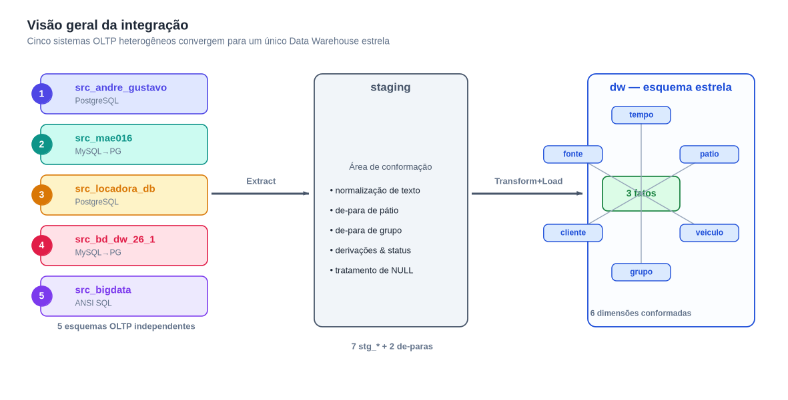
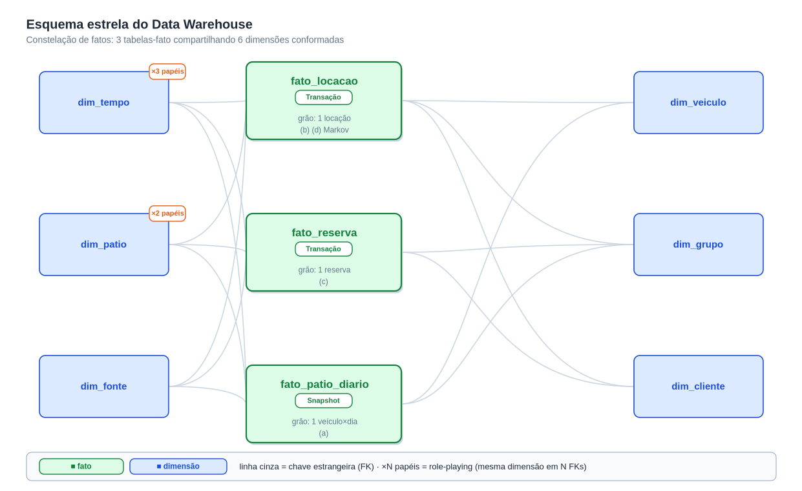

<!--
Avaliação 02 — Modelagem de DW — Parte II
Grupo:
  - Gustavo Oliveira Pessanha da Silva (DRE 122051824)
  - André Vinícius Lobo Giron (DRE 122050404)
-->

---
title: "Modelo Dimensional Estrela do Data Warehouse"
subtitle: "Avaliação 02 — Parte II · Modelagem de Data Warehouse (EEL890) · Tema: locadora de veículos"
author:
  - "Gustavo Oliveira Pessanha da Silva — DRE 122051824"
  - "André Vinícius Lobo Giron — DRE 122050404"
date: "Rio de Janeiro · 30 de maio de 2026"
lang: pt-BR
toc-title: "Sumário"
---

# 1. Introdução

Este relatório resume o **modelo dimensional** criado para integrar cinco
sistemas OLTP de locadoras em um único DW. A proposta é permitir análises que
os sistemas isolados não conseguem responder. O processo ETL está no relatório
irmão `docs/relatorio-etl.pdf`.

{ width=15cm }

# 2. Fontes integradas

As fontes escolhidas foram as que continham os atributos exigidos pelos
relatórios do enunciado:

| `sk_fonte` | Schema | Origem |
|---|---|---|
| 1 | `src_andre_gustavo` | Parte I do próprio grupo |
| 2 | `src_mae016` | MySQL (traduzido) |
| 3 | `src_locadora_db` | PostgreSQL |
| 4 | `src_bd_dw_26_1` | MySQL (traduzido) |
| 5 | `src_bigdata` | ANSI SQL |

# 3. Esquema estrela

Optamos por um esquema estrela simples, com **3 fatos** e **6 dimensões
conformadas**. Isso foi suficiente para cobrir os quatro relatórios e a análise
por matriz de Markov.

{ width=15cm }

## 3.1 Fatos

- `fato_locacao` (transação): uma linha por locação concluída ou em andamento.
- `fato_reserva` (transação): uma linha por reserva registrada.
- `fato_patio_diario` (snapshot): veículos por pátio em cada dia.

## 3.2 Dimensões

- `dim_tempo`: calendário com *smart-key* `YYYYMMDD`.
- `dim_patio`: seis pátios canônicos + sentinela.
- `dim_veiculo`: veículos por fonte (sem deduplicação entre fontes).
- `dim_grupo`: categorias conformadas (ECONOMICO, COMPACTO, etc.).
- `dim_cliente`: clientes por fonte.
- `dim_fonte`: cadastro das fontes/empresas.

# 4. Conformação e decisões

Os principais pontos de decisão foram:

- **Pátios e grupos** precisaram de padronização, pois cada fonte usava nomes
  diferentes. Usamos tabelas de-para simples para unificar.
- **SCD Tipo 1** em todas as dimensões, já que o foco do trabalho era integração
  e não histórico detalhado.
- **Dimensão fonte** presente em todos os fatos para rastrear a origem dos
  dados e justificar a integração.

# 5. Uso analítico

Com esse modelo foi possível gerar:

1. Controle de pátios (frota própria vs. associadas).
2. Controle de locações.
3. Controle de reservas por cidade.
4. Grupos mais alugados cruzados com cidade.
5. Matriz de Markov de movimentação entre pátios.

# 6. Conclusão

O modelo ficou compacto e suficiente para o escopo da disciplina. Mesmo com
fontes diferentes, a conformação das dimensões permitiu análises unificadas. A
estrutura pode ser estendida no futuro com novos fatos ou dimensões, mas já
atende ao que foi pedido.

# Referências

- Kimball & Ross, *The Data Warehouse Toolkit*, 3ª ed.
- Elmasri & Navathe, *Sistemas de Banco de Dados*, 7ª ed.
