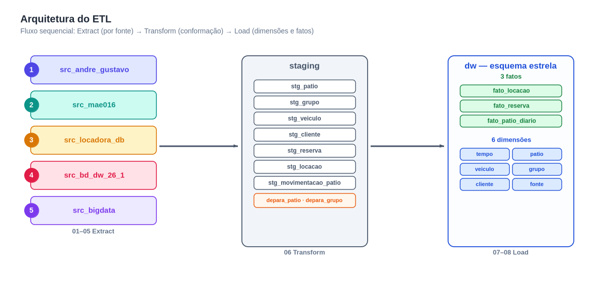
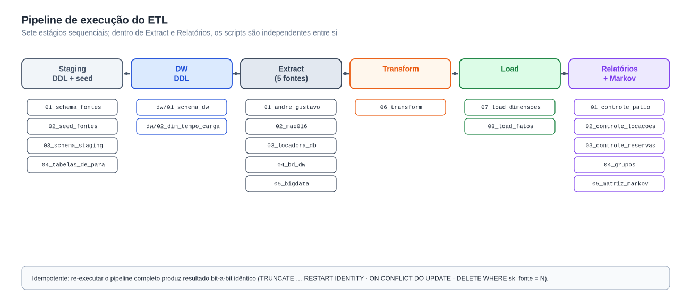
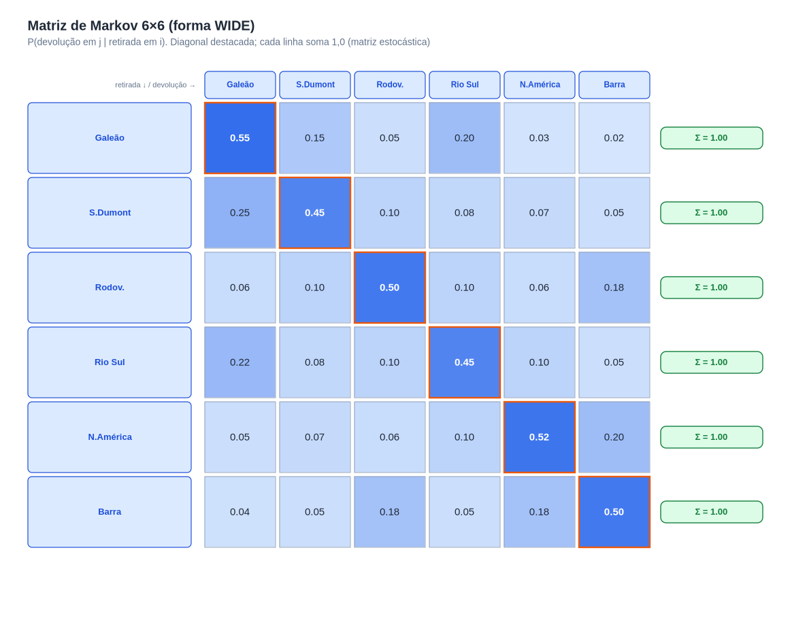

<!--
Avaliação 02 — Modelagem de DW — Parte II
Grupo:
  - Gustavo Oliveira Pessanha da Silva (DRE 122051824)
  - André Vinícius Lobo Giron (DRE 122050404)
-->

---
title: "Processo ETL e Integração de Fontes"
subtitle: "Avaliação 02 — Parte II · Modelagem de Data Warehouse (EEL890) · Tema: locadora de veículos"
author:
  - "Gustavo Oliveira Pessanha da Silva — DRE 122051824"
  - "André Vinícius Lobo Giron — DRE 122050404"
date: "Rio de Janeiro · 30 de maio de 2026"
lang: pt-BR
toc-title: "Sumário"
---

# 1. Introdução

Este relatório resume o **processo ETL** que usamos no trabalho da disciplina para
integrar cinco bancos OLTP de locadoras em um único Data Warehouse. A ideia foi
manter o processo simples e rastreável, com uma área de *staging* comum e
cargas idempotentes. O modelo dimensional está no relatório irmão
`docs/relatorio-dimensional.pdf`.

# 2. Fontes e escolhas

As cinco fontes integradas e seus schemas no Postgres:

| `sk_fonte` | Schema | Origem |
|---|---|---|
| 1 | `src_andre_gustavo` | Parte I do próprio grupo |
| 2 | `src_mae016` | MySQL (traduzido) |
| 3 | `src_locadora_db` | PostgreSQL |
| 4 | `src_bd_dw_26_1` | MySQL (traduzido) |
| 5 | `src_bigdata` | ANSI SQL |

Também avaliamos outras fontes, mas **três foram excluídas** porque não tinham
atributos essenciais para os relatórios (cidade do cliente, grupo do veículo ou
pátio de devolução). Isso ficou claro quando começamos a comparar as tabelas.

# 3. Visão geral do ETL

Seguimos o fluxo clássico **fontes → staging → DW**. Cada fonte é extraída de forma
isolada, depois tudo passa por uma transformação comum e, por fim, carregamos
as dimensões e os fatos.

{ width=15cm }

O pipeline ficou com sete etapas, mas a execução é simples: extract das cinco
fontes, transform único e load em sequência.

{ width=15cm }

# 4. Transformações principais

O que mais deu trabalho foi padronizar os dados antes do load:

- **Pátios e empresas:** nomes diferentes para os mesmos pátios; criamos um
  de/para simples para padronizar.
- **Grupos de veículos:** categorias com nomes diferentes (ex.: “SUV” vs
  “UTILITÁRIO”); ajustamos para um conjunto único.
- **Datas e chaves:** padronizamos datas para `DATE`/`TIMESTAMP` e criamos
  chaves substitutas nas dimensões.
- **Idempotência:** os scripts limpam a fatia da fonte antes de inserir, para
  permitir reexecução.

# 5. Relatórios e matriz de Markov

Com o DW pronto, geramos os quatro relatórios pedidos no enunciado:

1. Controle de pátio (frota própria vs. associadas).
2. Controle de locações.
3. Controle de reservas por cidade de origem.
4. Grupos mais alugados cruzados com cidade.

Também construímos a **matriz de Markov** de movimentação entre pátios usando as
locações concluídas.

{ width=14cm }

# 6. Problemas encontrados

Alguns pontos que apareceram durante o desenvolvimento:

- **Campos faltando** em fontes candidatas (ex.: cidade do cliente), que
  obrigaram a exclusão de alguns grupos.
- **Inconsistências de nomes** (pátios e grupos), resolvidas com tabelas de-para.
- **Diferenças de SGBD** (MySQL → Postgres), que exigiram ajustes simples de DDL.

Esses problemas foram os principais motivos para manter o ETL direto e sem
muitas camadas extras.

# 7. Conclusão

O ETL final ficou simples, mas atende ao enunciado. Conseguimos integrar as
cinco fontes escolhidas, gerar o DW estrela e produzir os relatórios pedidos.
Ainda há espaço para melhorias (ex.: automatizar traduções e validar dados), mas
para o escopo da disciplina o resultado foi satisfatório.

# Referências

- Kimball & Ross, *The Data Warehouse Toolkit*, 3ª ed.
- Elmasri & Navathe, *Sistemas de Banco de Dados*, 7ª ed.
